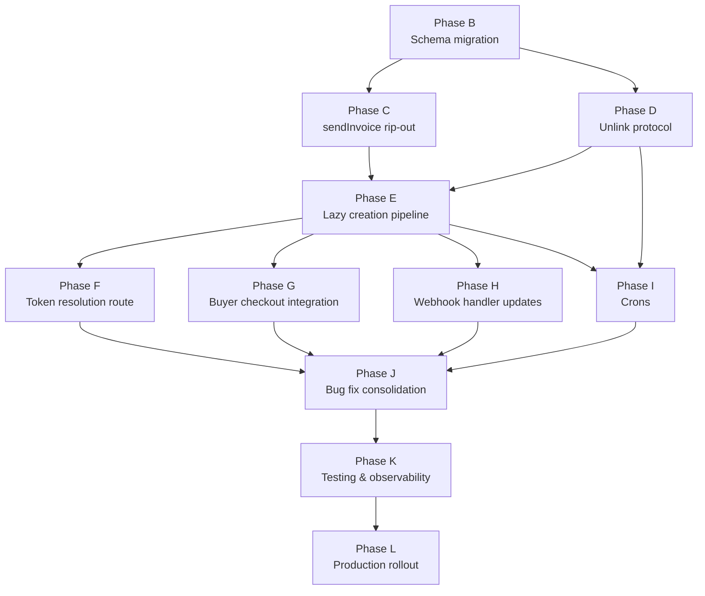

# Draft Order Invoice Flow — Implementation Roadmap

| Field | Value |
| --- | --- |
| **Version** | 1.0 |
| **Owner** | Leo / Pressify AB |
| **Status** | Active — implementation in progress |
| **Implements** | `draft-orders-invoice-flow.md` v1.2 (binding spec) |
| **Quality bar** | "Would Shopify approve this?" |

This document operationalises the v1.2 design document. It does not
introduce architecture; it sequences and scopes the work.

**Rule of precedence.** If anything in this roadmap conflicts with v1.2,
v1.2 wins. The conflict is treated as a roadmap bug, not a design bug.
If the conflict reveals a problem in v1.2, work pauses and v1.2 is
amended to v1.3.

**Phase boundaries are sacred.** Each phase has explicit acceptance
criteria. A phase is not done until all criteria are met. Bleeding work
across phases is forbidden — it defeats the purpose of phased delivery
and makes rollback impossible.

---

## How to read this document

For each phase you will find:

- **Scope.** What this phase delivers, in one paragraph.
- **Files touched.** Specific files, by path.
- **Dependencies.** Phases that must be green before this one starts.
- **Tasks.** Numbered, in execution order.
- **Acceptance criteria.** Testable. Yes/no answers only.
- **Invariants verified.** Cross-references to v1.2 §5.
- **Pre-existing bugs addressed.** Cross-references to v1.2 §13.
- **Effort estimate.** In Claude Code session-blocks (one block ≈
  one focused conversation, 30–90 min of work).
- **Ready-for-next checklist.** What must be true before unblocking
  the next phase.

---

## Phase dependency graph



Phases on the same horizontal level can be executed in parallel by
separate Claude Code sessions, provided their files don't overlap (and
they don't — file scopes are disjoint by design).

---

## Phase B — Schema migration & data model foundation

### Scope

Create the new `DraftCheckoutSession` model. Drop `pricesFrozenAt` from
`DraftOrder`. Add `holdReleaseReason` to `DraftReservation`. Single
migration. No services touched.

### Files touched

- `prisma/schema.prisma` — model + enum additions, column drop
- `prisma/migrations/<timestamp>_add_draft_checkout_session/migration.sql`
  — generated migration with raw SQL appended for partial unique index

### Dependencies

None. This is the foundation.

### Tasks

1. Edit `schema.prisma`:
   - Add `DraftCheckoutSession` model per v1.2 §3.1 verbatim.
   - Add `DraftCheckoutSessionStatus` enum per v1.2 §3.1.
   - Remove `pricesFrozenAt` column from `DraftOrder`.
   - Add `holdReleaseReason String?` to `DraftReservation`.
   - Add comment block on `DraftCheckoutSession` documenting the
     partial unique index that's appended via raw SQL (per CLAUDE.md
     migrations workflow rule on partial indexes).

2. Run `npx prisma generate` to confirm schema parses cleanly.

3. Run `npm run db:migrate` (which is `prisma migrate dev`) with name
   `add_draft_checkout_session`. Verify migration file is generated.

4. Append raw SQL to the migration file under the standard
   "Partial unique indexes" comment block:
   ```sql
   -- Partial unique indexes (not expressible in Prisma DSL)
   CREATE UNIQUE INDEX "DraftCheckoutSession_one_active_per_draft"
     ON "DraftCheckoutSession" ("draftOrderId")
     WHERE status = 'ACTIVE';
   ```

5. Re-run migration against a fresh dev DB to confirm it builds the
   schema from scratch (CLAUDE.md rule 5).

6. Run `npx prisma migrate status` against dev DB; must report
   "up to date."

7. Run `npm run build` and `npm run test` to confirm nothing else
   breaks. Existing tests that reference `pricesFrozenAt` will fail —
   that is expected and Phase C addresses them. Document them in a
   list for Phase C handoff.

### Acceptance criteria

- [ ] `prisma migrate deploy` against an empty database produces the
      complete current schema, including the partial unique index.
- [ ] `prisma migrate status` reports "up to date" on dev DB.
- [ ] `prisma generate` produces a client that compiles
      (`npm run build` succeeds for any file not referencing the
      removed `pricesFrozenAt`).
- [ ] Inspect the actual DB: `\d "DraftCheckoutSession"` in psql shows
      all columns from §3.1, all indexes, partial unique constraint.
- [ ] No data loss possible (verified: prod has zero rows in any
      draft table).

### Invariants verified

None directly — this is foundation. Subsequent phases verify against
the schema.

### Pre-existing bugs addressed

None — schema only.

### Effort estimate

1 session-block.

### Ready-for-next checklist

- [ ] Migration committed and merged to main.
- [ ] List of compile errors caused by `pricesFrozenAt` removal
      passed to Phase C.
- [ ] Schema deployed to staging Render PostgreSQL.

---

## Phase C — `sendInvoice` rip-out

### Scope

Strip eager PI creation, hold placement, and `pricesFrozenAt` handling
from the invoice-send flow. After this phase, sending an invoice
performs only: status transition (`OPEN`/`APPROVED` → `INVOICED`),
share-link token generation, email send.

### Files touched

- `app/_lib/draft-orders/lifecycle.ts` — strip `sendInvoice` and remove
  `sendInvoiceIdempotentReplay` (only meaningful under eager model)
- `app/_lib/draft-orders/lifecycle.ts` — remove `freezePrices` function
  (no longer needed without `pricesFrozenAt`)
- `app/_lib/draft-orders/types.ts` — remove
  `getDraftStripePaymentIntentId` helper
- `app/_lib/draft-orders/mark-as-paid.ts` — stop reading PI from
  metafields (Phase D will add the unlink call)
- `app/(admin)/draft-orders/[id]/actions.ts:sendDraftInvoiceAction` —
  remove `freezePrices` call; sequence becomes call `sendInvoice`,
  then `sendEmailEvent("DRAFT_INVOICE")`
- Any test file that asserts `pricesFrozenAt` or PI-on-send behaviour

### Dependencies

- Phase B (schema must be migrated; `pricesFrozenAt` no longer in DB)

### Tasks

1. Rewrite `lifecycle.ts:sendInvoice`. New behaviour, in order:
   - Validate preconditions S1, S2, S4, S5 (status, line items,
     totals, customer). S3 (accommodation hold-eligibility) and S6
     (Stripe readiness) **move to lazy creation pipeline** (Phase E).
   - Generate `shareLinkToken` (base64url 24 bytes). Persist on draft.
   - Clamp share-link TTL against `expiresAt`.
   - Build `invoiceUrl = {portalSlug}.rutgr.com/invoice/{token}` —
     unchanged.
   - Transition `status: APPROVED|OPEN → INVOICED`.
   - Set `invoiceSentAt = now`.
   - Emit `INVOICE_SENT` event.
   - Commit.
   - Post-commit: emit platform webhook `draft_order.invoiced`.
   - Return `{ draft, invoiceUrl, shareLinkToken }`. **No
     `clientSecret`, no `paymentIntentId`** in return value.

2. Delete `sendInvoiceIdempotentReplay`. The new `sendInvoice` is
   trivially idempotent on status — re-sending an already-`INVOICED`
   draft only re-sends the email (action layer concern).

3. Delete `freezePrices` function and all call sites. The action
   layer no longer calls it before `sendInvoice`.

4. Delete `getDraftStripePaymentIntentId` from `types.ts`. Grep for
   all readers of `metafields.stripePaymentIntentId` and remove them.

5. Update `mark-as-paid.ts`:
   - Remove the read of PI from metafields (lines 63, 149 per VP3).
   - Mark with a `TODO: unlink active session — Phase D` comment.
     Phase D wires this up.
   - For now, the function operates without PI awareness. **This is
     temporarily worse than current behaviour** — but the window is
     short (Phase D is next) and prod is empty so no real bookings
     are exposed.

6. Update `[id]/actions.ts:sendDraftInvoiceAction`:
   - Remove the `freezePrices` call before `sendInvoice`.
   - Sequence becomes: `sendInvoice(draftId)` → `sendEmailEvent` →
     return result.
   - The `emailStatus` field in the return type is unchanged.

7. Update all failing tests from Phase B's compile-error list:
   - Remove assertions that `pricesFrozenAt` is set.
   - Remove tests for `sendInvoiceIdempotentReplay` (function gone).
   - Update `sendInvoice` happy-path tests: assert no Stripe SDK
     called, no PMS adapter called.
   - Add a regression test: `sendInvoice` makes zero calls to
     `getStripe()` or `resolveAdapter()`.

8. Run full test suite. Expect green.

### Acceptance criteria

- [ ] `sendInvoice` makes zero external calls (verified by mocking
      `getStripe` and `resolveAdapter` and asserting they're untouched).
- [ ] `freezePrices`, `sendInvoiceIdempotentReplay`, and
      `getDraftStripePaymentIntentId` are deleted from the codebase.
- [ ] `mark-as-paid.ts` no longer reads
      `metafields.stripePaymentIntentId`.
- [ ] `npm run test` is green.
- [ ] `npm run build` is clean.
- [ ] Manual smoke: create draft → send invoice → confirm draft is
      `INVOICED`, has token, has email sent. No PI exists at Stripe.

### Invariants verified

- Invariant 3: `sendInvoice` makes zero external calls beyond email.

### Pre-existing bugs addressed

- §13.3 (PI creation outside transaction) — no longer relevant since
  PI is no longer created here.

### Effort estimate

2 session-blocks. Test fixup is the largest part.

### Ready-for-next checklist

- [ ] All tests green.
- [ ] No code path creates a PaymentIntent at invoice-send time.
- [ ] `mark-as-paid.ts` has the `TODO: unlink` comment marking where
      Phase D will integrate.

---

## Phase D — Unlink protocol

### Scope

Implement `unlinkActiveCheckoutSession(draftId, tx)`. Wire it into
every mutating service function. Audit and fix the `version`
optimistic-concurrency-control inconsistencies. Fix the mark-as-paid
double-charge bug.

### Files touched

- `app/_lib/draft-orders/unlink.ts` (new) — the helper
- `app/_lib/draft-orders/lines.ts` — three mutations
- `app/_lib/draft-orders/discount.ts` — two mutations
- `app/_lib/draft-orders/update-customer.ts`
- `app/_lib/draft-orders/update-meta.ts`
- `app/_lib/draft-orders/mark-as-paid.ts` — finishes Phase C TODO
- All eight files: add `version`-CAS guards and `version++` on update

### Dependencies

- Phase B (`DraftCheckoutSession` table must exist)
- Phase C does not strictly need to be done first, but should be —
  having `mark-as-paid.ts` in a clean state makes the unlink
  integration cleaner

### Tasks

1. Create `app/_lib/draft-orders/unlink.ts`. Export
   `unlinkActiveCheckoutSession(draftId, tx, reason)`:
   - Find active session: `findFirst { draftOrderId, status: ACTIVE }`.
   - If none, return `{ unlinked: false }`.
   - Update session: `status=UNLINKED`, `unlinkedAt=now`,
     `unlinkReason=reason`, `version++` (CAS-guarded).
   - Find all `DraftReservation` where `draftOrderId` matches and
     `holdState=PLACED`.
   - Update each: `holdState=RELEASED`,
     `holdReleaseReason="session_unlinked"`.
   - Emit `STATE_CHANGED` event with metadata `{ previousSessionId,
     reason }`.
   - Return `{ unlinked: true, sessionId, releasedHoldExternalIds,
     stripePaymentIntentId }`.
   - Caller is responsible for the post-commit best-effort actions
     (PMS release + Stripe cancel).

2. Create `app/_lib/draft-orders/unlink-post-commit.ts`. Export
   `runUnlinkSideEffects({ tenantId, releasedHoldExternalIds,
   stripePaymentIntentId })`:
   - For each hold ID, call `adapter.releaseHold(...)`. Catch and
     log `draft_invoice.hold_release_failed` per failure.
   - If `stripePaymentIntentId`, call
     `tryCancelStripePaymentIntent(piId, tenant)` — extract this
     helper from `cancelDraft` if it isn't already exported.
   - All failures are logged, none re-thrown.

3. For each of the seven mutating service functions (lines×3,
   discount×2, update-customer, update-meta), modify so that:
   - Inside the existing transaction, after the mutation but before
     commit, call `unlinkActiveCheckoutSession(draftId, tx, "draft_mutated")`.
   - On the result, schedule `runUnlinkSideEffects` to run after
     commit (use the existing post-commit pattern from
     `cancelDraft`).
   - Pass `unlinkResult` back to the caller for observability.

4. Update `mark-as-paid.ts`:
   - Add `unlinkActiveCheckoutSession(draftId, tx, "marked_paid_manually")`
     as the FIRST step inside the transaction.
   - Schedule `runUnlinkSideEffects` after commit.
   - Remove the Phase C `TODO: unlink` comment.
   - This is the §13.1 fix.

5. **Audit-and-fix `version` consistency** (closes §11.1):
   - For every mutating service function (the eight above plus
     `cancelDraft`, `lifecycle.ts:sendInvoice`,
     `convert.ts:convertDraftToOrder`):
     - Confirm the function reads `draft.version` at start.
     - Confirm the update uses `where: { id, version: oldVersion }`
       and increments `version`.
     - On `count === 0` from `updateMany` (or P2025 from `update`),
       throw `VERSION_CONFLICT` typed error.
   - Add a regression test per function: simulate a stale read,
     confirm `VERSION_CONFLICT` is thrown.

6. Add an integration test `unlink.integration.test.ts`:
   - Create a draft, INVOICE it, manually create a fake `ACTIVE`
     `DraftCheckoutSession` (foreshadowing Phase E).
   - For each of the eight mutations, perform it and assert:
     - Session status went `ACTIVE` → `UNLINKED`.
     - Released holds have `holdState=RELEASED`,
       `holdReleaseReason="session_unlinked"`.
     - `STATE_CHANGED` event emitted with correct metadata.

7. Add a specific test for §13.1: mark-as-paid double-charge:
   - Setup: draft with active session and PI.
   - Call `markDraftAsPaid`.
   - Assert: session is `UNLINKED`, PI cancellation is attempted
     post-commit. Mark-as-paid succeeds (records the manual payment).
   - This proves the bug is fixed.

### Acceptance criteria

- [ ] `unlinkActiveCheckoutSession` exists, is unit-tested, is called
      from all eight mutating service functions.
- [ ] `runUnlinkSideEffects` exists, is unit-tested with mock adapter
      and Stripe.
- [ ] `markDraftAsPaid` calls unlink as its first step. Test verifies
      §13.1 is fixed.
- [ ] Every mutating service function has a `VERSION_CONFLICT` test.
- [ ] Integration test `unlink.integration.test.ts` covers all eight
      mutations end-to-end.
- [ ] `npm run test` is green.

### Invariants verified

- Invariant 4: every draft mutation calls
  `unlinkActiveCheckoutSession()`.
- Invariant 5: `markDraftAsPaid` calls unlink as hard prerequisite.
- Invariant 6: unlink is atomic in DB, eventually consistent at edge.
- Invariant 8: hold release on unlink is best-effort but logged.
- Invariant 9: PI cancellation on unlink is best-effort but logged.
- Invariant 13: draft mutation during `EXPIRED`/`UNLINKED` session is
  a no-op for the session.

### Pre-existing bugs addressed

- §13.1 (mark-as-paid double-charge) — fully fixed.

### Effort estimate

3 session-blocks. The audit-and-fix of `version` consistency is the
biggest unknown — could be larger if many functions need it.

### Ready-for-next checklist

- [ ] All eight mutations have unlink wired in.
- [ ] All tests green.
- [ ] §13.1 has a passing regression test.
- [ ] `version` audit complete; CAS-guards everywhere.

---

## Phase E — Lazy checkout creation pipeline

### Scope

Implement `createDraftCheckoutSession(draftId)` per v1.2 §7.3. This is
the heart of the new architecture — the function that actually
creates the session, places the hold, creates the PI.

### Files touched

- `app/_lib/draft-orders/checkout-session.ts` (new) — the pipeline
- `app/_lib/draft-orders/checkout-session-types.ts` (new) — Zod
  schemas + TypeScript types
- Existing `placeHoldsForDraft` in `holds.ts` — confirm it's
  unchanged (it is — it's already correct contract)
- Existing `previewDraftTotals` in `preview-totals.ts` — confirm
  unchanged

### Dependencies

- Phase B (schema)
- Phase C (sendInvoice cleanup, so the new flow doesn't conflict)
- Phase D not strictly required, but its unlink helper is needed
  during failure paths

### Tasks

1. Create `checkout-session-types.ts`:
   - `CreateDraftCheckoutSessionInputSchema` — `{ draftOrderId,
     tenantId }`.
   - `DraftCheckoutSessionResult` — `{ session, redirectUrl,
     clientSecret }` for happy path.
   - `DraftCheckoutSessionFailure` — discriminated union for
     `unit_unavailable | stripe_unavailable | embedded_mode_unavailable`.

2. Create `checkout-session.ts`:
   - Export `createDraftCheckoutSession(input)`.
   - Step 1 (snapshot calc): call `previewDraftTotals(draftId)`,
     extract frozen amounts.
   - Step 2 (session insert): in tx, validate draft is `INVOICED` and
     `expiresAt > now`. Insert `DraftCheckoutSession` with
     `status=ACTIVE`, `expiresAt=now+24h`, frozen snapshot,
     `stripeIdempotencyKey=sha256(draftId|version|nonce)`,
     `stripePaymentIntentId=NULL`. Commit.
   - Catch P2002 on the partial unique index → race-loser path:
     query existing `ACTIVE` session, return `{ session, redirectUrl,
     clientSecret }` from existing record.
   - Step 3 (hold placement): call `placeHoldsForDraft(draftId,
     sessionId)` outside tx. On failure, in new tx mark session
     `CANCELLED`, return `{ failure: "unit_unavailable" }`.
   - Step 4 (embedded-mode pre-check, §13.4): verify Connect account
     supports embedded payment forms. If not, in new tx mark session
     `CANCELLED`, return `{ failure: "embedded_mode_unavailable" }`.
   - Step 5 (PI create): Stripe `paymentIntents.create` with
     idempotency key, Connect-account context,
     `amount=frozenTotal`, metadata `{ draftOrderId,
     draftCheckoutSessionId, kind: "draft_order_invoice" }`.
   - Step 6 (persist PI): in new tx, update session with
     `stripePaymentIntentId`, `stripeClientSecret`. CAS on
     session.version.
   - Return `{ session, redirectUrl: "/checkout?session={id}",
     clientSecret }`.

3. Move `assertTenantStripeReady` from `lifecycle.ts` (where it was
   gutted in Phase C) to here, called as part of step 4. Or
   inline-equivalent — the function may need refactoring to also
   check embedded-mode capability per §13.4.

4. Add comprehensive unit tests for `checkout-session.ts`:
   - Happy path: all 6 steps succeed, session is `ACTIVE` with PI.
   - Step 2 race: partial unique violation → returns existing session.
   - Step 3 fail: hold placement fails → session `CANCELLED`,
     returns `unit_unavailable`.
   - Step 4 fail: embedded-mode unavailable → session `CANCELLED`,
     returns `embedded_mode_unavailable` (this is §13.4 fix).
   - Step 5 fail: Stripe network error → session `CANCELLED`,
     returns `stripe_unavailable`.
   - Step 5 succeed but step 6 fail (network blip on persist): the
     PI exists at Stripe, the session has no PI ID. Watchdog cron
     in Phase I cleans this up. Test verifies session is in
     "stuck" state for watchdog to handle.

5. Add invariant assertions in unit tests:
   - Invariant 1: `createDraftCheckoutSession` is the only function
     in the codebase that creates a session row. Grep test.
   - Invariant 7: PI metadata contains both `draftOrderId` and
     `draftCheckoutSessionId`.
   - Invariant 17: amount in PI === `frozenTotal`, never recomputed.

### Acceptance criteria

- [ ] `createDraftCheckoutSession` is implemented per §7.3.
- [ ] All five failure modes return typed failure objects (not
      throws).
- [ ] §13.4 embedded-mode pre-check is in place.
- [ ] Unit tests cover all six steps and all failure paths.
- [ ] Integration test: end-to-end happy path against fake adapter +
      Stripe test mode.
- [ ] Race test: two concurrent calls to
      `createDraftCheckoutSession` for the same draft produce one
      session, both callers return the same session ID and client
      secret.

### Invariants verified

- Invariant 1: lazy creation only.
- Invariant 2: at most one ACTIVE session per draft.
- Invariant 7: PI metadata.
- Invariant 11: concurrent token opens collide on partial unique.
- Invariant 16: session amount is authoritative.

### Pre-existing bugs addressed

- §13.4 (embedded-mode pre-check) — wired in step 4.

### Effort estimate

3 session-blocks. Step 2 race handling and the post-step-5 stuck
state are subtle.

### Ready-for-next checklist

- [ ] All tests green.
- [ ] Race test passes deterministically (no flakes).
- [ ] Failure modes return typed objects, not throws.

---

## Phase F — Token resolution route

### Scope

Implement `/invoice/[token]/page.tsx`. It resolves the token,
classifies state per §7.2, and either redirects to checkout or
renders a status page.

### Files touched

- `app/(guest)/invoice/[token]/page.tsx` (new) — the route
- `app/(guest)/invoice/[token]/_components/PaidReceipt.tsx` (new)
- `app/(guest)/invoice/[token]/_components/CancelledPage.tsx` (new)
- `app/(guest)/invoice/[token]/_components/ExpiredPage.tsx` (new)
- `app/(guest)/invoice/[token]/_components/UnitUnavailablePage.tsx` (new)
- `app/_lib/draft-orders/resolve-token.ts` (new) — token lookup +
  state classification

### Dependencies

- Phase E (`createDraftCheckoutSession` exists)

### Tasks

1. Create `resolve-token.ts`:
   - Export `resolveDraftByToken(token)` — single Prisma query
     with `include: { draftCheckoutSessions: { where: { status:
     "ACTIVE" } } }`. Returns `null` if not found.
   - Export `classifyTokenState(draft)` returning a discriminated
     union: `{ kind: "fresh" } | { kind: "resume", session } | {
     kind: "paid", order } | { kind: "cancelled" } | { kind:
     "expired" } | { kind: "not_found" }`. Implements §7.2 decision
     tree exactly.

2. Create `app/(guest)/invoice/[token]/page.tsx`:
   - Server component. `force-dynamic` because token resolution
     must always be live.
   - Calls `resolveDraftByToken(params.token)`.
   - On `not_found` → 404.
   - On `fresh` → call `createDraftCheckoutSession`, redirect to
     `/checkout?session={id}`.
   - On `resume` → redirect to `/checkout?session={existing.id}`.
   - On `paid` → render `<PaidReceipt order={...} />`.
   - On `cancelled` → render `<CancelledPage />`.
   - On `expired` → render `<ExpiredPage />`.
   - On `failure: unit_unavailable` → render `<UnitUnavailablePage />`.

3. Build the four status-page components. Use existing design tokens
   from `base.css` per CLAUDE.md component-reuse rules. No new modal
   or overlay patterns.

4. Add tests for `classifyTokenState` covering all 8 forks in §7.2's
   decision tree.

5. Add an end-to-end test for the route:
   - Create draft, invoice it.
   - Open `/invoice/{token}` → assert redirect to `/checkout`.
   - Open again → assert resume (same session).
   - Mark draft as paid → open token → assert receipt.
   - Cancel a different draft → open token → assert cancelled page.

### Acceptance criteria

- [ ] All 8 forks from §7.2 are reachable in tests.
- [ ] Token resolution is read-only on `paid`, `cancelled`,
      `expired`, `not_found` (invariant 10).
- [ ] Token resolution creates session only on `fresh` fork.
- [ ] Status pages use only existing CSS tokens, no new patterns.

### Invariants verified

- Invariant 10: token resolution is read-only on no-state-change forks.
- Invariant 14: `shareLinkToken` immutable; cancelled drafts still
  resolve.

### Pre-existing bugs addressed

None directly.

### Effort estimate

2 session-blocks.

### Ready-for-next checklist

- [ ] Route is reachable. Manual smoke through full happy path.
- [ ] All tests green.

---

## Phase G — Buyer checkout integration

### Scope

The `/checkout` route already handles accommodation flows. Extend it
to accept a `?session=` query param that loads a `DraftCheckoutSession`
instead of a raw cart. Add the polling endpoint and unlink-detection UI.

### Files touched

- `app/(guest)/checkout/page.tsx` — accept session param
- `app/(guest)/checkout/CheckoutClient.tsx` — polling logic
- `app/(guest)/checkout/_components/UnlinkedNotice.tsx` (new)
- `app/api/checkout/session-status/route.ts` (new) — polling endpoint

### Dependencies

- Phase E (sessions exist)
- Phase F (route resolves and redirects here)

### Tasks

1. Update `/checkout/page.tsx` to detect `?session={id}` param. If
   present, load the `DraftCheckoutSession`, validate it's `ACTIVE`,
   and pass `clientSecret`, `frozenTotal`, line items snapshot to
   `CheckoutClient`. If session is not `ACTIVE`, redirect to
   `/invoice/{token}` to re-classify.

2. In `CheckoutClient.tsx`, add 15-second polling against
   `/api/checkout/session-status?id={sessionId}`. On response
   `{ status: "UNLINKED" | "EXPIRED" | "CANCELLED" }`, replace
   the form with `<UnlinkedNotice />`.

3. Create `/api/checkout/session-status/route.ts`:
   - GET only.
   - Accept `id` query param.
   - Cache the response per session ID in Upstash Redis with 5s TTL
     (per v1.2 §11.4). 4 req/min/tab × 10k tabs = 40k req/min, but
     against 5s-cached entries this collapses to 2 req/sec/session
     average DB load.
   - Return `{ status, lastBuyerActivityAt }` — minimal payload.
   - Update `lastBuyerActivityAt` on the session every time the
     endpoint is called (debounced — only update if last update was
     >30s ago, to limit DB write load).

4. Build `UnlinkedNotice.tsx`:
   - "Beställningen har uppdaterats. Öppna länken i ditt mejl på
     nytt för att fortsätta." (Swedish, per CLAUDE.md UI convention).
   - Reuse existing `.com__overlay`/`.com__modal` per CLAUDE.md
     component-reuse mandate.

5. Tests:
   - Polling fetches and updates UI within 15s of unlink.
   - Stripe submit on UNLINKED session shows the same notice (Stripe
     rejects → UI handles).

### Acceptance criteria

- [ ] Buyer who arrives at `/checkout?session={id}` sees fully
      functional Elements form, can pay successfully.
- [ ] Polling detects `UNLINKED` within 15s and replaces form.
- [ ] Submit during the polling window (before next poll) is handled
      gracefully — Stripe rejection routes to same notice.
- [ ] No new modal/overlay CSS introduced.

### Invariants verified

- (Indirect) The polling mechanism enforces invariant 13: buyer cannot
  pay on UNLINKED session.

### Pre-existing bugs addressed

None directly.

### Effort estimate

2 session-blocks.

### Ready-for-next checklist

- [ ] End-to-end happy path passes.
- [ ] Unlink-detection works in manual test.
- [ ] No CSS drift.

---

## Phase H — Webhook handler updates

### Scope

Update `/api/webhooks/stripe/handle-draft-order-pi.ts` to use
session-based lookup. Add the auto-refund path for the
UNLINKED-session-paid race (§6.4).

### Files touched

- `app/api/webhooks/stripe/handle-draft-order-pi.ts`
- `app/_lib/draft-orders/lifecycle.ts` — adjust the PAID transition
  helper if needed

### Dependencies

- Phase E (sessions and PI on session)
- Phase D (unlink helper exists; UNLINKED status detectable)

### Tasks

1. Rewrite `handle-draft-order-pi.ts`:
   - Lookup by `stripePaymentIntentId` against `DraftCheckoutSession`
     first. Fall back to PI metadata only if not found (which would
     indicate corruption).
   - If session not found → log `draft_invoice.webhook_orphan_pi`,
     ack 200 (don't retry).
   - If session.status === `ACTIVE`:
     - Tx 1: transition session `ACTIVE` → `PAID`, draft `INVOICED`
       → `PAID`. Idempotent on session ID per invariant 16.
     - Tx 2: `convertDraftToOrder`.
     - Post-commit: emit `draft_order.paid` platform webhook (kept
       from current handler).
   - If session.status === `UNLINKED` → §6.4 auto-refund path:
     - Call `stripe.refunds.create({ payment_intent: piId })` with
       Connect-account context.
     - Update session: set `unlinkReason="unlinked_paid_refunded"`
       (or similar).
     - Log `draft_invoice.unlinked_session_paid_refunded` with
       structured fields.
     - Send operator alert via `sendOperatorAlert` helper.
     - Send buyer email "we have refunded you, please contact the
       hotel" — needs new email template (TODO: spec separately;
       could reuse existing infra).
   - If session.status === `EXPIRED` per invariant 12: still proceed
     with PAID transition (Stripe is source of truth for "money
     moved"). Log `draft_invoice.expired_session_paid_transitioned`
     for observability.
   - If session.status === `PAID` already → idempotent no-op,
     ack 200.

2. Update existing event-dedup logic to use session ID where
   appropriate, but `StripeWebhookEvent` table-level dedup still
   protects from re-delivery.

3. Tests:
   - Happy path: ACTIVE → PAID → convert → emit webhook.
   - UNLINKED race: refund path runs.
   - EXPIRED late delivery: still transitions to PAID.
   - PAID idempotent: re-delivery doesn't double-create order.
   - Orphan PI: ack 200 with log entry.

### Acceptance criteria

- [ ] Webhook handler routes correctly on all five session states.
- [ ] Auto-refund path is tested end-to-end against Stripe test mode.
- [ ] Operator alert fires on auto-refund.
- [ ] Idempotency holds on re-delivery.

### Invariants verified

- Invariant 12: `expiresAt` enforced in webhook.
- Invariant 16: webhook idempotent on session ID.

### Pre-existing bugs addressed

None directly.

### Effort estimate

2 session-blocks.

### Ready-for-next checklist

- [ ] All tests green.
- [ ] Auto-refund verified in Stripe test mode dashboard.

---

## Phase I — Crons (hold refresh, watchdog, expiry sweep)

### Scope

Three crons need to exist by the end of this phase, plus one needs to
be updated (`release-expired-draft-holds` per §13.2).

### Files touched

- `app/api/cron/refresh-draft-holds/route.ts` (new) — §6.5
- `app/api/cron/sweep-stuck-sessions/route.ts` (new) — §6.4 watchdog
- `app/api/cron/expire-draft-sessions/route.ts` (new) — §7.4 + 2h inactivity
- `app/api/cron/release-expired-draft-holds/route.ts` (existing) —
  add session-status filter per §13.2
- `vercel.json` — schedule entries

### Dependencies

- Phase D (unlink helper for hold-refresh-failed and inactivity sweep)
- Phase E (sessions exist)

### Tasks

1. **Hold refresh cron** (`refresh-draft-holds/route.ts`):
   - Schedule: every 5 minutes.
   - Auth: Bearer `CRON_SECRET`.
   - Query `ACTIVE` sessions where
     `lastHoldRefreshAt IS NULL OR lastHoldRefreshAt < now - 14min`.
   - For each, run release-and-replace per §6.5.
   - On failure: increment `holdRefreshFailureCount`. At 3, call
     `unlinkActiveCheckoutSession(draftId, tx, "hold_refresh_failed")`
     and `runUnlinkSideEffects`.
   - Batch size: 50 per run, ordered by `lastHoldRefreshAt ASC`.
   - Log `pms.hold_refresh.attempted/succeeded/failed` for each.

2. **Watchdog cron** (`sweep-stuck-sessions/route.ts`):
   - Schedule: every minute. (Vercel cron minimum 1 min.)
   - Query `ACTIVE` sessions where
     `createdAt < now - 30s AND stripePaymentIntentId IS NULL`.
   - Mark each `CANCELLED` with `unlinkReason="stuck_no_pi"`.
   - This is the §6.4 stuck-state safety net.
   - Log `draft_invoice.stuck_session_swept`.

3. **Expiry sweep cron** (`expire-draft-sessions/route.ts`):
   - Schedule: every 5 minutes.
   - Query `ACTIVE` sessions where one of:
     - `expiresAt < now` (24h hard cap) → reason `"buyer_abandoned"`.
     - `lastBuyerActivityAt < now - 2h` (inactivity) → reason
       `"buyer_abandoned"`.
   - For each, run unlink protocol with appropriate reason. Final
     status is `EXPIRED`, not `UNLINKED` — the difference matters
     for analytics (UNLINKED means merchant edited; EXPIRED means
     buyer abandoned).
   - Note: `unlinkActiveCheckoutSession` writes `UNLINKED`. We need
     either a parallel `expireActiveCheckoutSession` helper or a
     parameter on the unlink helper to control the resulting status.
     Recommend: parameter. `unlinkActiveCheckoutSession(draftId, tx,
     reason, { resultStatus: "UNLINKED" | "EXPIRED" })`.

4. **Update `release-expired-draft-holds`** (§13.2 fix):
   - Existing query selects holds with `holdState=PLACED` and
     `holdExpiresAt < now`.
   - Add filter: only release if the parent draft has no `ACTIVE`
     session.
   - Specifically, join through `DraftReservation` →
     `DraftOrder` → `DraftCheckoutSession` and exclude any reservation
     whose draft has a session in `ACTIVE` state.
   - Holds owned by `ACTIVE` sessions are refreshed by the hold
     refresh cron, not released here.
   - Add a regression test: setup an `ACTIVE` session with a hold
     past `holdExpiresAt`. Run the cron. Assert the hold is NOT
     released.

5. Update `vercel.json` with all four cron entries.

### Acceptance criteria

- [ ] Hold refresh cron successfully refreshes holds in dev against
      fake adapter, against Mews staging.
- [ ] After 3 consecutive refresh failures, session is unlinked with
      correct reason. Test verifies.
- [ ] Watchdog cron sweeps stuck sessions within 1 minute of becoming
      stuck.
- [ ] Expiry sweep handles both 24h cap and 2h inactivity.
- [ ] §13.2 regression test passes.
- [ ] All four crons authenticate via `CRON_SECRET`.

### Invariants verified

- Invariant 18: `release-expired-draft-holds` consults session status.
- Invariant 19: hold refresh failures count and trigger unlink at 3.
- Invariant 20: 24h hard cap.

### Pre-existing bugs addressed

- §13.2 (release-expired-draft-holds without session check) — fixed.

### Effort estimate

3 session-blocks. Hold refresh has subtle Mews integration work.

### Ready-for-next checklist

- [ ] All four crons exist and run on schedule.
- [ ] All tests green.
- [ ] Manual smoke against Mews staging confirms hold refresh works.

---

## Phase J — Bug fix consolidation

### Scope

By this phase all four §13 bugs should already be addressed by earlier
phases. This phase is verification and any leftover work.

### Tasks

1. §13.1 (mark-as-paid double-charge) — verified in Phase D. Re-run
   regression test.
2. §13.2 (release-expired-draft-holds) — verified in Phase I. Re-run
   regression test.
3. §13.3 (PI race window) — solved architecturally in Phase E +
   Phase I watchdog. Verify watchdog test passes.
4. §13.4 (embedded-mode rejection) — handled in Phase E step 4.
   Verify test passes against a Connect account without embedded
   capability.

If any of the four does not have a passing regression test, this
phase fixes it. Otherwise this phase is a 30-minute verification
checkpoint.

### Acceptance criteria

- [ ] Each of the four §13 bugs has a named, passing regression test
      file.
- [ ] Each regression test would fail if the corresponding fix were
      reverted.

### Effort estimate

0.5–1 session-block.

---

## Phase K — Testing, observability, hardening

### Scope

End-to-end tests for all 23 edge cases in v1.2 §8. Sentry
instrumentation. Structured logging. SLO dashboards.

### Files touched

- `tests/e2e/draft-orders-invoice/*` — one file per edge case group
- `app/_lib/observability/sentry.ts` — add tags for session ID
- All log() call sites added in earlier phases — confirm completeness

### Dependencies

- All earlier phases (B–J).

### Tasks

1. Build E2E test suite. Group edge cases by setup similarity:
   - Group 1 (cases 1–4): basic state forks. Setup: token + draft
     in various states.
   - Group 2 (cases 5, 23): expiry and inactivity sweeps.
   - Group 3 (cases 6, 15, 21): unlink scenarios.
   - Group 4 (case 7): concurrent open.
   - Group 5 (cases 8, 16): payment success paths.
   - Group 6 (cases 9, 11, 14): payment failure paths.
   - Group 7 (case 10, 22): PMS failures, hold-refresh failures.
   - Group 8 (case 17): UNLINKED-paid race.
   - Group 9 (case 18, 19, 20): tokens, devices, multi-mutation.
   - Group 10 (case 12, 13): re-send, never-opened.

2. Sentry tagging:
   - Confirm `setSentryTenantContext` is called at every entry point
     (it should already be, per CLAUDE.md, but verify the new routes
     `/invoice/[token]` and `/api/checkout/session-status` set it).
   - Add `sessionId` as a Sentry tag where a session is in scope.

3. SLO dashboard signals (document in
   `docs/observability/draft-invoice-slos.md`):
   - `draft_invoice.session_created` (rate)
   - `draft_invoice.session_paid` (rate)
   - `draft_invoice.session_unlinked` by reason (rate)
   - `draft_invoice.session_expired` (rate)
   - `draft_invoice.unlinked_session_paid_refunded` (count — should
     be near zero)
   - `draft_invoice.stuck_session_swept` (count — should be near zero)
   - `pms.hold_refresh.attempted` (rate)
   - `pms.hold_refresh.failed` consecutive count (gauge per session)
   - `pms.hold_refresh.session_unlinked` (count — should be near zero)

4. Confirm structured logging is in place at every state transition
   per CLAUDE.md "Structured logging only" mandate. No `console.*`
   in any new file.

### Acceptance criteria

- [ ] All 23 edge cases have passing E2E tests.
- [ ] Sentry tags include `sessionId` where applicable.
- [ ] SLO documentation exists.
- [ ] No new `console.*` calls in any new code (grep confirms).

### Effort estimate

3 session-blocks.

### Ready-for-next checklist

- [ ] Full E2E suite green.
- [ ] Observability signals visible in Sentry/Datadog/wherever logs land.

---

## Phase L — Production rollout

### Scope

Deploy to Apelviken pilot. Monitor.

### Tasks

1. Deploy migration §3.4 to Render production PostgreSQL during a
   low-traffic window. Confirm via `\d "DraftCheckoutSession"`.
2. Deploy code to Vercel production.
3. Monitor for 24 hours:
   - Sentry error rate.
   - Cron execution health.
   - First real Apelviken invoice send → buyer pay → order convert flow.
4. If a P1 incident: `git revert` the deploy. Migration is forward-only
   but harmless — the `DraftCheckoutSession` table simply sits unused,
   and `pricesFrozenAt` removal had zero data to lose.
5. After 7 days of stable operation, declare Phase L done.

### Acceptance criteria

- [ ] First end-to-end invoice flow from Apelviken merchant → real
      buyer → paid order completes successfully.
- [ ] Zero P1 incidents in first 7 days.
- [ ] All SLO signals reading nominal.

### Effort estimate

1 session-block for deploy. 7 days of passive monitoring.

---

## Total effort estimate

| Phase | Session-blocks |
| --- | --- |
| B — Schema | 1 |
| C — sendInvoice rip-out | 2 |
| D — Unlink protocol | 3 |
| E — Lazy creation pipeline | 3 |
| F — Token resolution route | 2 |
| G — Buyer checkout integration | 2 |
| H — Webhook handler | 2 |
| I — Crons | 3 |
| J — Bug verification | 0.5–1 |
| K — Testing & observability | 3 |
| L — Rollout | 1 |
| **Total** | **22.5–23.5** |

At one or two session-blocks per day, this is **2–3 weeks of focused
work**. Apelviken target launch is October 2026 — ample time, no
schedule pressure to cut corners.

---

## Cross-phase tracking matrix

| Invariant | Phase that establishes it |
| --- | --- |
| 1 (lazy creation only) | E |
| 2 (one ACTIVE per draft) | B (DB), E (logic) |
| 3 (sendInvoice no external calls) | C |
| 4 (every mutation calls unlink) | D |
| 5 (mark-as-paid unlinks) | D |
| 6 (unlink atomic + eventual) | D |
| 7 (PI metadata) | E |
| 8 (hold release best-effort) | D |
| 9 (PI cancel best-effort) | D |
| 10 (token resolution read-only on no-state-change) | F |
| 11 (concurrent opens collide) | E |
| 12 (expiresAt enforced twice) | H, I |
| 13 (mutation on EXPIRED/UNLINKED no-op) | D |
| 14 (token immutable) | C (already holds) |
| 15 (OVERDUE blocks payment) | F |
| 16 (webhook idempotent) | H |
| 17 (frozen prices authoritative) | E, H |
| 18 (release cron consults session) | I |
| 19 (hold refresh failures unlink at 3) | I |
| 20 (24h hard cap) | I, E |

| Pre-existing bug | Phase that fixes it |
| --- | --- |
| §13.1 mark-as-paid double-charge | D |
| §13.2 release-expired-draft-holds | I |
| §13.3 PI race window | E + I (architectural + watchdog) |
| §13.4 embedded-mode rejection | E |

---

## Amendment process

If during any phase the implementation reveals a problem in v1.2:

1. Stop work in that phase.
2. Document the problem in this roadmap as a comment under the
   relevant phase.
3. Amend v1.2 to v1.3 (or higher), going through the same review
   cycle as the original document.
4. Update this roadmap if the amendment changes phase scope.
5. Resume work.

No silent deviations. Every divergence from v1.2 produces a
versioned amendment.

---

*End of roadmap.*
