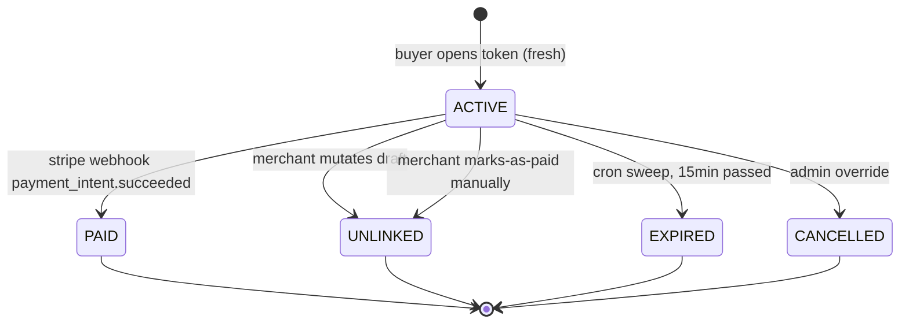
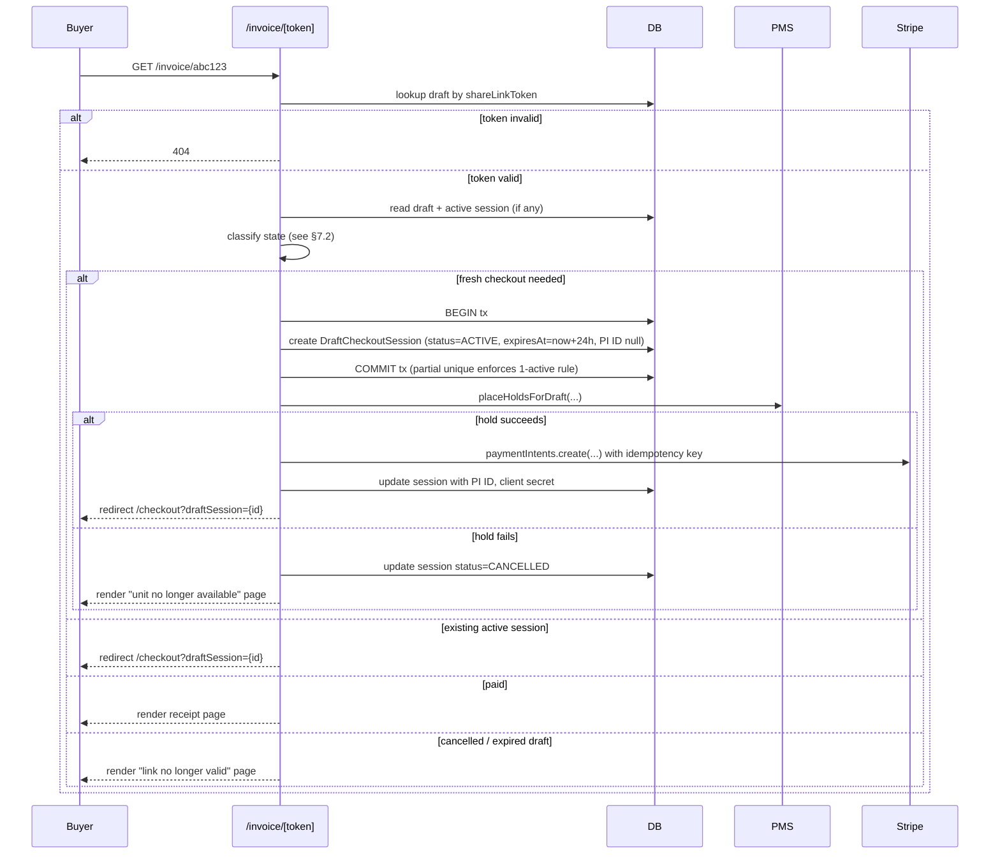

# Draft Order Invoice Flow — Architecture Design Document

| Field | Value |
| --- | --- |
| **Version** | 1.3 (binding) |
| **Owner** | Leo / Pressify AB |
| **Status** | **Approved — implementation may proceed** |
| **Quality bar** | "Would Shopify approve this?" |
| **Scope** | Draft-order invoice → buyer payment → order conversion |
| **Out of scope** | B2B approval workflow, line-discount UI, accommodation as first-class entity |

This document is binding. No code is written for the invoice/payment surface
of draft orders until this document is reviewed and approved. Once approved,
deviation requires an amendment to this document — not an inline comment in
a PR.

### Changelog from v1.0

| § | Change | Source |
| --- | --- | --- |
| §1.2 Problem 1 | Corrected `sendInvoice` step list (steps 2, 8 occur in action layer, not service); token is base64url(24 bytes) not hex(32); host is `rutgr.com` | VP1 |
| §1.2 Problem 2 | `pricesFrozenAt` is a precondition to `sendInvoice`, not an effect of it | VP2 |
| §3.1 | `stripePaymentIntentId` is a typed column on `DraftCheckoutSession` from day one — not a migrated metafield | VP4 |
| §3.2 | `pricesFrozenAt` removed (decision 11.2 locked) | VP2 + 11.2 |
| §3.4 | Migration plan reduced to one migration (no backfill needed) | VP4 |
| §5 | Removed backwards-compat invariant; added invariant on mark-as-paid + active-session interaction | VP3 + VP4 |
| §6.1 | Added `markDraftAsPaid` and `release-expired-draft-holds` cron to unlink-aware mutations | VP3 |
| §6.4 | Added subsection on PI-creation race window outside transaction | Verification additional risk |
| §9 | Single-phase rollout (no dual-write needed) | VP4 |
| §11 | 11.2 closed (remove `pricesFrozenAt`) | VP2 + verification |
| §13 (new) | Pre-existing bugs discovered during verification | VP3 + risks |

### Changelog from v1.1 to v1.2 (binding version)

| § | Change | Source |
| --- | --- | --- |
| §3.1 | Added `lastHoldRefreshAt`, `holdRefreshFailureCount` to `DraftCheckoutSession` | §11.5 closure |
| §6.5 (new) | Hold refresh protocol — keeps PMS hold alive for 24h sessions | §11.5 closure |
| §7.4 | Session lifetime: 24h hard cap (Shopify model), with hold-refresh every 14 min | §11.5 closure |
| §5 | Added invariant 19 (hold refresh failure transitions session to EXPIRED) | §11.5 closure |
| §8 | Added edge cases 22, 23 (hold-refresh failure, buyer reactivates after long absence) | §11.5 closure |
| §11 | All four open questions closed: 11.1 audit-and-fix, 11.3 status quo, 11.4 polling 15s, 11.5 24h Shopify model with hold-refresh | Final review |
| §12 | Go/no-go checklist all items confirmed | Final review |

### Changelog from v1.2 to v1.3

| § | Change | Source |
| --- | --- | --- |
| §2.2 + §7.2 | Buyer redirect target changed from `/checkout?session={id}` to `/checkout?draftSession={id}` to avoid collision with the storefront `CheckoutSession`'s `session=` param; route must early-branch on `searchParams.draftSession` before the storefront loader runs | Phase E recon |
| §3.3 | Clarified that session ownership of `DraftReservation` rows is implicit (no FK), enforced by invariant 18 plus the partial unique active-session index in §3.1 | Phase E recon |
| §6.4 + §7.3 | Defensive in-pipeline cleanup spelled out per failure step (3, 4, 5) with explicit hold-release and Stripe-cancel compensation; orphan reuse on step-2 P2002 collision uses CAS guard against double-cancel races | Phase E recon |
| §7.3 step 1 | Snapshot helper corrected from `previewDraftTotals` to `computeDraftTotals(tenantId, draftOrderId, {}, tx)` — `previewDraftTotals` takes a `lines[]` input for the pre-save flow and cannot snapshot an existing `INVOICED` draft by id | Phase E recon |
| §7.3 step 4 + §13.4 | New helper `verifyEmbeddedModeReady(stripeAccountId)` in `_lib/stripe/verify-account.ts` (capabilities.card_payments active + requirements.disabled_reason null/undefined, 60s cache); composed by `assertTenantStripeReady` after `verifyChargesEnabled` | Phase E recon |
| §7.3 | `assertTenantStripeReady` relocated to `_lib/stripe/verify-account.ts` and exported; all Stripe-readiness checks colocate, `lifecycle.ts`'s public surface stays minimal | Phase E recon |
| §7.3 | `createDraftCheckoutSession` returns a discriminated union (`created` / `resumed` / `unit_unavailable` / `stripe_unavailable` / `tenant_not_ready` / `draft_not_payable`); throws reserved for programmer errors so Phase F can render fork pages without parsing exception messages | Phase E recon |

---

## Table of contents

1. Problem statement & current state
2. The four foundational decisions
3. Data model
4. State machines
5. Invariants
6. The unlink protocol
7. The lazy creation pipeline
8. Edge cases catalog
9. Migration & rollout
10. Out of scope
11. Closed questions
12. Go / no-go checklist
13. Pre-existing bugs uncovered during verification

---

## 1. Problem statement & current state

### 1.1 What we have today

The draft-order domain is, at the time of writing, production-ready end-to-end
on the **admin side**. Schema, services, server actions, and admin UI all
exist for create → edit → freeze → invoice → mark-paid → cancel + cron
sweepers. The single material gap is the **buyer side**: the link in the
`DRAFT_INVOICE` email points to `{slug}.rutgr.com/invoice/{token}`, but
no route in the application renders that URL. A buyer who clicks the link
hits a 404.

The simplest possible fix would be to build a page at `/invoice/[token]`
that loads the draft, displays line items, and renders a Stripe Elements
form bound to the existing `stripePaymentIntentId` stored in
`DraftOrder.metafields`. That fix would *work* in the narrow sense.

It would not pass a Shopify review.

### 1.2 What is structurally wrong with the current architecture

The current invoice-send flow, distributed across `lifecycle.ts:sendInvoice`
(service) and `actions.ts:sendDraftInvoiceAction` (action layer), does the
following in this order:

**Action layer (`[id]/actions.ts:sendDraftInvoiceAction`):**

1. Calls `freezePrices` if not already frozen — emits `PRICES_FROZEN`.
   This is a precondition to invoice send, not part of it.

**Service layer (`lifecycle.ts:sendInvoice`):**

2. Idempotent-replay short-circuit: if draft is already `INVOICED` and a
   `stripePaymentIntentId` exists in metafields, re-issues `clientSecret`
   without state mutation (`lifecycle.ts:501`).
3. Validates preconditions S1–S6 (status, line items, totals, customer,
   accommodation hold-eligibility, tenant Stripe readiness).
4. Calls `assertTenantStripeReady` (`lifecycle.ts:425`) — verifies
   `charges_enabled` on the tenant's Connect account.
5. Generates `shareLinkToken` — base64url-encoded 24 random bytes
   (`lifecycle.ts:605`).
6. Builds `invoiceUrl = {portalSlug}.rutgr.com/invoice/{token}`.
7. Clamps share-link TTL against `expiresAt`.
8. **Creates a Stripe `PaymentIntent` immediately** via
   `initiateOrderPayment` from `app/_lib/payments/providers`, with
   `metadata.kind = "draft_order_invoice"`. The PI ID is persisted into
   `DraftOrder.metafields` (read back later via
   `getDraftStripePaymentIntentId`, `types.ts:576`).
9. Transitions `status: APPROVED|OPEN → INVOICED`.
10. Emits `INVOICE_SENT` event.
11. Post-commit: emits platform webhook `draft_order.invoiced`.

**Back in action layer:**

12. Triggers `DRAFT_INVOICE` email (best-effort).

There are four structural problems with this. Each one alone would warrant
an architectural rethink. Together they are disqualifying.

**Problem 1 — Eager binding of payment context to draft state.**
At step 8 we lock the buyer's payment amount, currency, line breakdown,
and Stripe Connect context to the draft's state at the moment the merchant
clicked "Send invoice." If the merchant edits the draft thirty seconds
later — corrects a typo, removes a line, applies a discount — the PI is
now stale. We have no mechanism to detect this divergence, and no
mechanism to repair it. The buyer who opens the link tomorrow will be
charged based on yesterday's prices.

**Problem 2 — `pricesFrozenAt` solves the wrong problem AND is one-way.**
The current model uses `pricesFrozenAt` as a lock that the merchant
applies *before* sending the invoice. Once set, it is **never cleared**
anywhere in the codebase. There is no unfreeze-path. This is defensive
in the worst way: it forces the merchant into an irreversible decision
before they even know if the buyer will pay. If the buyer asks for a
modification mid-checkout, the merchant cannot make it without
cancelling and recreating the draft.

**Problem 3 — No unlink mechanism.**
If the merchant *does* edit a frozen draft (cancel + recreate, or via
admin override), there is no protocol for invalidating the in-flight
PaymentIntent, releasing PMS holds, or notifying a buyer who may have
the checkout page open. The buyer can complete payment on stale data
while the merchant believes the draft is updated.

**Problem 4 — Conflation of "status" and "payment lifecycle."**
`DraftOrderStatus.INVOICED` currently means three things at once:
"merchant has sent the invoice email," "a PaymentIntent exists," and
"the buyer can pay." These are independent concerns. They should be
modelled as such.

### 1.3 What Shopify does

Shopify's model is documented in three authoritative sources, and it is
the same model in all three.

From the **Help Center** (creating draft orders):

> "By default, the invoice contains a link to a checkout, where your
> customer can pay for their order."

From the **GraphQL Admin API** documentation for the `DraftOrder` object,
field `invoiceUrl`:

> "The link to the checkout, which is sent to the customer in the
> invoice email."

And from the same API documentation, `draftOrderInvoiceSend` mutation:

> "Sends an invoice email for a DraftOrder. The invoice includes a
> secure checkout link for reviewing and paying for the order."

The architecturally decisive sentence is buried in the documentation
for `draftOrderUpdate`:

> "If a checkout has been started for a draft order, any update to
> the draft will unlink the checkout. Checkouts are created but not
> immediately completed when opening the merchant credit card modal
> in the admin, **and when a buyer opens the invoice URL**. This is
> usually fine, but there is an edge case where a checkout is in
> progress and the draft is updated before the checkout completes.
> This will not interfere with the checkout and order creation, but
> if the link from draft to checkout is broken the draft will remain
> open even after the order is created."

Three things to extract from this:

1. The invoice URL is **the checkout** — same checkout engine the
   storefront uses, just with a different entry point.
2. The checkout is **created lazily** when the buyer opens the URL,
   not eagerly when the merchant sends the invoice.
3. Editing a draft after the buyer has started a checkout **unlinks**
   the checkout. Shopify's unlink is permissive (the in-flight
   checkout completes anyway), but the protocol exists.

### 1.4 Why we cannot just copy Shopify

Shopify's permissive unlink — "the checkout completes anyway, the draft
stays open" — works for them because their inventory model is trivial:
a SKU has a quantity, you decrement it. There is no external system
holding a reservation that must be released if the buyer abandons.

We have PMS holds. When a buyer opens an invoice link for an
accommodation booking, we place a hold at Mews (or whichever PMS) for
the unit, dates, and rate plan in the draft. That hold expires after
fifteen minutes. If the merchant edits the draft mid-checkout — say,
removes the accommodation line and replaces it with a different unit —
Shopify's permissive model would let the buyer complete the original
checkout, leaving us with: a paid order for unit A, a hold still
pending at Mews for unit A (which we'd auto-release), and a draft now
referring to unit B that the merchant *believes* is reserved.

That is unacceptable. Our unlink must be **hard**: cancel the in-flight
checkout, release the hold, void the PaymentIntent, force the buyer to
re-open the link. This is more disruptive than Shopify's model. It is
also correct given our constraints.

---

## 2. The four foundational decisions

These four decisions are the load-bearing beams of the architecture.
Everything in the rest of the document follows from them. Changing any
of these four requires re-reviewing the entire document.

### 2.1 Decision: Lazy checkout creation

**Decision.** No `PaymentIntent` is created at invoice-send time. The
checkout — including PI, hold placement, and price freeze — is created
lazily when the buyer opens the invoice URL for the first time.

**Rationale.** Eager creation binds payment state to draft state at the
wrong moment. The merchant's intent at "send invoice" is to communicate
with the buyer, not to commit to immutable payment terms. Lazy creation
defers that commitment to the moment the buyer is actually ready to pay,
which is also the moment the merchant has lost the ability to silently
update the draft without the buyer noticing.

**Implication.** `sendInvoice` becomes a much smaller operation: status
transition, token generation, email send. No Stripe calls. No PMS calls.
The full checkout pipeline runs on the buyer's first GET to
`/invoice/[token]`.

### 2.2 Decision: One checkout engine, multiple entry points

**Decision.** The buyer who opens an invoice URL goes through the same
checkout flow as a buyer who arrives via the storefront search →
select → pay path. Same components, same UI, same PaymentIntent
handling, same webhook code. The only thing different is the entry
point.

**Rationale.** Two separate checkouts means two separate things to
keep in sync forever — totals calculation, tax, hold logic, error
handling, branding, accessibility, mobile responsiveness, tests. We
already have `/checkout` (Elements flow for accommodation). Building
a parallel buyer-facing checkout at `/invoice/[token]` would duplicate
that surface and guarantee drift.

**Implication.** `/invoice/[token]` is a **router**, not a checkout.
It resolves the token, decides what state the draft is in (fresh,
resumable, paid, cancelled, expired), and either redirects to
`/checkout?draftSession={id}` or renders a small status page (paid →
receipt, cancelled → "contact hotel," expired → "link no longer
valid").

`app/(guest)/checkout/page.tsx` must early-branch on
`searchParams.draftSession` before the existing `session=` storefront
loader runs. The two params are mutually exclusive: presence of
`draftSession` routes through the `DraftCheckoutSession` lookup,
absence falls through to the storefront `CheckoutSession` path. This
implementation belongs to Phase F; it is documented here so the
Phase F prompt is bound by the param contract.

### 2.3 Decision: Hard unlink on draft mutation

**Decision.** Any merchant-side mutation to a draft with an active
`DraftCheckoutSession` triggers a hard unlink: cancel the checkout
session, release the PMS hold, cancel the PaymentIntent, mark the
session `UNLINKED`. The buyer who is mid-checkout sees a
"draft has changed — please reopen the link" state. The next GET to
`/invoice/[token]` creates a fresh checkout from the new draft state.

**Rationale.** Discussed in §1.4. Our PMS-hold model precludes
Shopify's permissive approach. Hard unlink is the only protocol that
maintains correctness when the draft and the checkout disagree.

**Implication.** Every service function that mutates a draft must be
aware of the active-checkout-session relation. We need a single
`unlinkActiveCheckoutSession(draftId, tx)` helper that all mutating
service functions call. Calling it must be enforced — possibly via a
Prisma extension, more pragmatically via a code-review checklist plus
an integration test that fails if a mutation doesn't unlink.

### 2.4 Decision: Status semantics decoupled from checkout state

**Decision.** `DraftOrderStatus.INVOICED` means exactly one thing:
"the merchant has sent the invoice email, and a buyer-side checkout
URL is valid." It does **not** imply that a PaymentIntent exists, or
that a checkout has been opened, or that the buyer has done anything
at all. Whether a checkout exists is the concern of
`DraftCheckoutSession`, a separate model with its own status field.

**Rationale.** Conflating the two concerns is what made `INVOICED`
unworkable in §1.2 problem 4. A draft can be `INVOICED` with zero,
one, or multiple historical checkout sessions (one per buyer-open
that didn't result in payment, plus the current active one if any).
Modelling this cleanly is what makes lazy creation and hard unlink
safe to reason about.

**Implication.** New model: `DraftCheckoutSession`. The Stripe
PaymentIntent ID lives there, **as a typed column**, never in
`DraftOrder.metafields`. `pricesFrozenAt` on the draft is removed
entirely (locked decision per §11.2).

---

## 3. Data model

### 3.1 New model: `DraftCheckoutSession`

```prisma
model DraftCheckoutSession {
  id                      String   @id @default(cuid())
  tenantId                String
  draftOrderId            String
  draftOrderVersion       Int      // version of draft when session was created

  status                  DraftCheckoutSessionStatus
  // ACTIVE | UNLINKED | EXPIRED | PAID | CANCELLED

  // Frozen snapshot — what the buyer sees and pays
  frozenSubtotal          BigInt
  frozenTaxAmount         BigInt
  frozenDiscountAmount    BigInt
  frozenTotal             BigInt
  currency                String

  // Stripe — typed columns, never via metafields
  stripePaymentIntentId   String?  @unique
  stripeClientSecret      String?  // returned to client; not sensitive in Stripe's design
  stripeIdempotencyKey    String   @unique

  // Hold refresh tracking (see §6.5)
  lastHoldRefreshAt       DateTime?
  holdRefreshFailureCount Int      @default(0)

  // Lifecycle timestamps
  createdAt               DateTime @default(now())
  expiresAt               DateTime // 24-hour hard cap from creation
  lastBuyerActivityAt     DateTime?
  paidAt                  DateTime?
  unlinkedAt              DateTime?
  unlinkReason            String?  // "draft_mutated" | "buyer_abandoned" | "manual_admin" | "marked_paid_manually" | "hold_refresh_failed"
  cancelledAt             DateTime?

  // Concurrency control
  version                 Int      @default(1)

  draftOrder              DraftOrder @relation(fields: [draftOrderId], references: [id], onDelete: Cascade)

  @@index([draftOrderId, status])
  @@index([tenantId, status])
  @@index([expiresAt, status])  // for sweep cron
  @@index([stripePaymentIntentId])
  @@index([status, lastHoldRefreshAt])  // for hold-refresh cron
}

enum DraftCheckoutSessionStatus {
  ACTIVE      // buyer can pay
  UNLINKED    // draft mutated mid-flight; PI cancelled, hold released
  EXPIRED     // 15-min window passed, swept by cron
  PAID        // PI succeeded, draft transitioned to PAID
  CANCELLED   // explicitly cancelled (rare; admin override)
}
```

**Partial unique constraint** (raw SQL, not expressible in Prisma DSL):

```sql
CREATE UNIQUE INDEX "DraftCheckoutSession_one_active_per_draft"
  ON "DraftCheckoutSession" ("draftOrderId")
  WHERE status = 'ACTIVE';
```

This guarantees at most one `ACTIVE` session per draft at any time.
Concurrent buyer-opens collide on this index; the race-loser is rejected
or returns the existing session (see §7.5).

### 3.2 Modified: `DraftOrder`

Removals:

- **`pricesFrozenAt`** — removed entirely. Decision 11.2 (now closed).
  The semantics it tried to provide are subsumed by
  `DraftCheckoutSession.status = ACTIVE` (a query, not a column).
  Removing it eliminates the never-cleared one-way-lock anti-pattern
  identified in §1.2 problem 2.
- **`metafields.stripePaymentIntentId`** — never used. PI ID lives on
  `DraftCheckoutSession` as a typed column from day one. (The
  production database has zero `DraftOrder` rows, so there is no
  legacy data to migrate. Verified VP4.)

Additions:

- None to schema. The existing `version: Int @default(1)` column
  remains, but its consistent enforcement is now mandatory (see
  §11.1 + §13).

Unchanged:

- `shareLinkToken` — still the URL identifier.
  **Format note:** base64url of 24 random bytes (verified VP1), not
  32-char hex as v1.0 documented.
- `invoiceSentAt` — semantics unchanged.

### 3.3 Modified: `DraftReservation`

The `holdState` machine itself is unchanged; the `PLACED → RELEASED`
transition is already legal. New field for observability:

```prisma
holdReleaseReason String?
// "session_unlinked" | "session_expired" | "draft_cancelled" | "session_completed" | "manual_release"
```

**Session ownership of holds is implicit.** There is no FK from
`DraftReservation` to `DraftCheckoutSession`. The relation is
enforced by invariant 18 (only `ACTIVE` sessions own `PLACED` holds)
together with the partial unique active-session index in §3.1, which
guarantees at most one `ACTIVE` session per draft. The hold-refresh
cron (§6.5) and the unlink protocol (§6.2) join via `DraftOrder`,
not via a direct reservation→session link.

### 3.4 Migration plan (single migration)

Because production has zero rows in any draft-order table (verified
VP4), there is no backfill, no dual-write phase, no compatibility
shim. One migration creates the new model and index.

```
Migration: add_draft_checkout_session_and_clean_draft_order
  - DROP COLUMN DraftOrder.pricesFrozenAt
    (no rows exist; safe drop)
  - CREATE TABLE DraftCheckoutSession with all columns from §3.1
  - CREATE TYPE DraftCheckoutSessionStatus enum
  - Standard indexes from §3.1
  - Partial unique index (raw SQL):
    CREATE UNIQUE INDEX ... WHERE status = 'ACTIVE'
  - ADD COLUMN DraftReservation.holdReleaseReason TEXT NULL
```

That is the full migration. No backfill script. No metafield-stripping
phase. No phased rollout.

### 3.5 Indexes summary

New indexes from §3.1:
- `DraftCheckoutSession_draftOrderId_status`
- `DraftCheckoutSession_tenantId_status`
- `DraftCheckoutSession_expiresAt_status` (sweep cron)
- `DraftCheckoutSession_stripePaymentIntentId` (webhook lookup)
- Partial unique on `(draftOrderId) WHERE status='ACTIVE'`

---

## 4. State machines

### 4.1 `DraftOrder` status — clarified, not changed

The existing state machine is unchanged in shape. What changes is
**interpretation**: `INVOICED` no longer implies "PI exists." It
implies "buyer-side URL is valid; checkout will be created on first
open."

```
OPEN              → INVOICED, PENDING_APPROVAL, CANCELLED
PENDING_APPROVAL  → APPROVED, REJECTED, CANCELLED
APPROVED          → INVOICED, CANCELLED
REJECTED          → ∅
INVOICED          → PAID, OVERDUE, CANCELLED
OVERDUE           → PAID, CANCELLED
PAID              → COMPLETING
COMPLETING        → COMPLETED      (transient)
COMPLETED         → ∅
CANCELLED         → ∅
```

### 4.2 `DraftCheckoutSession` status — new



Terminal states: `PAID`, `UNLINKED`, `EXPIRED`, `CANCELLED`.
A draft can have many historical sessions, at most one `ACTIVE` at a time.

Note the second `ACTIVE → UNLINKED` arrow: if the merchant manually
marks the draft as paid via `markDraftAsPaid` while a buyer has an
active checkout open, that session **must** unlink (PI cancelled) to
avoid double-charge. See §13.

### 4.3 `DraftReservation` hold state — refined

The hold state machine itself is unchanged, but the **owners** are
clarified. While a `DraftCheckoutSession` is `ACTIVE`, that session is
the holder-of-record for any `PLACED` holds on the draft's
reservations. Unlink/expire/cancel of the session must trigger
`PLACED → RELEASED` on those holds (the existing machine allows this).

Explicit invariant: a `DraftReservation.holdState = PLACED` may not
exist without an `ACTIVE` `DraftCheckoutSession` referencing the
parent draft, **except** during the placing-pipeline window (the
3-phase commit in `holds.ts` already handles this via `PLACING`).

### 4.4 Cross-machine invariants

| If draft status is | Then session status can be |
| --- | --- |
| OPEN, PENDING_APPROVAL, APPROVED | (no sessions exist) |
| INVOICED | ACTIVE, UNLINKED, EXPIRED, CANCELLED — but never PAID |
| OVERDUE | UNLINKED, EXPIRED — buyer cannot open OVERDUE drafts (see §7) |
| PAID | exactly one session in PAID, possibly historical UNLINKED/EXPIRED |
| COMPLETING / COMPLETED | exactly one session in PAID |
| CANCELLED | any session must be in CANCELLED, UNLINKED, or EXPIRED |
| REJECTED | (no sessions exist; never invoiced) |

---

## 5. Invariants

These are the rules that must hold under every code path. Each is
testable. Violation of any is a release-blocking bug.

1. **Lazy creation only.** No code path outside `/invoice/[token]`
   creates a `DraftCheckoutSession`. `sendInvoice` does not. Admin
   actions do not. Cron does not.

2. **At most one `ACTIVE` session per draft** at any time. Enforced by
   partial unique index. Race-losers query the existing session.

3. **`sendInvoice` makes zero external calls** beyond the email send.
   No Stripe API. No PMS API. If it does, the design is violated.

4. **Every draft mutation calls `unlinkActiveCheckoutSession()`** as
   the last step inside the transaction, before commit. Mutations that
   skip this are bugs.

5. **`markDraftAsPaid` calls `unlinkActiveCheckoutSession()` as a hard
   prerequisite.** Manual mark-as-paid while an active session exists
   must cancel the session and PI before recording the manual payment.
   See §13 for the pre-existing bug this resolves.

6. **Unlink is atomic in the database, eventually consistent at the
   edge.** The DB transaction marks the session `UNLINKED`. Releasing
   the hold at the PMS and cancelling the PI at Stripe happen *after*
   commit and may fail; both have retry ladders.

7. **Stripe PI metadata always includes `draftOrderId` AND
   `draftCheckoutSessionId`.** The webhook handler looks up by
   `stripePaymentIntentId` first, falls back to metadata if needed.

8. **Hold release on unlink is best-effort but logged.** If the PMS
   call fails, the local session is still `UNLINKED`. The hold
   eventually expires on the PMS side via `ReleasedUtc`. We log
   `draft_invoice.hold_release_failed` for observability.

9. **PI cancellation on unlink is best-effort but logged.** If
   Stripe is unreachable, local state is still `UNLINKED`. A retry
   cron drains failed cancellations. The Stripe PI auto-cancels after
   24h if uncaptured.

10. **Token resolution is read-only.** A `GET /invoice/[token]` that
    doesn't lead to a state-change (e.g. just renders a paid receipt)
    makes no writes.

11. **Concurrent token opens collide on the partial unique index.**
    The race-loser does not retry; it queries and returns the
    existing `ACTIVE` session.

12. **`expiresAt` on a session is enforced in two places.** The
    cron sweeps it; the webhook handler also checks it before
    transitioning to `PAID` (defensive — Stripe could deliver
    succeeded for an expired session via late webhook).

13. **Draft mutation during an `EXPIRED` or `UNLINKED` session is a
    no-op for the session.** Only `ACTIVE` sessions get unlinked.

14. **`shareLinkToken` is immutable for the lifetime of the draft.**
    Re-sending an invoice does not rotate it. Cancelling does not
    invalidate it (the cancelled state is what the buyer sees).

15. **A draft in `OVERDUE` cannot be paid via the invoice URL.**
    Paying an overdue invoice requires the merchant to first
    transition it back to `INVOICED` (which itself requires updating
    `expiresAt`). This is a product decision, not a technical
    constraint.

16. **The webhook handler is idempotent on session ID.** Receiving
    `payment_intent.succeeded` twice for the same session results in
    one transition, not two. Existing dedup via `StripeWebhookEvent`
    plus `canTransition` covers this.

17. **The frozen prices on the session are authoritative for what the
    buyer pays.** The Stripe `amount` is set from
    `DraftCheckoutSession.frozenTotal`, never recomputed from the
    draft at webhook time.

18. **`release-expired-draft-holds` cron consults
    `DraftCheckoutSession.status` before releasing.** Releasing a hold
    that belongs to a session in any state other than `EXPIRED` is a
    bug. See §13.

19. **Hold refresh failures count and trigger unlink.** Three
    consecutive failures of the hold-refresh protocol (§6.5)
    transition the session to `UNLINKED` with reason
    `hold_refresh_failed`. The buyer cannot complete payment on a
    session whose underlying PMS hold has been lost.

20. **Session lifetime is a hard 24-hour cap from creation.** No
    lifetime extension on resume. No "buyer is active so let it live
    longer." Inactivity-based early-expire (2h) is the only deviation,
    and it expires *earlier*, never later.

---

## 6. The unlink protocol

### 6.1 What triggers unlink

Any merchant-initiated mutation to a draft with `status=INVOICED` AND
an `ACTIVE` `DraftCheckoutSession` triggers unlink.

**Mutations that trigger unlink (must call `unlinkActiveCheckoutSession`):**

| Mutation | Service function | Notes |
| --- | --- | --- |
| Add line item | `lines.ts:addLineItem` | |
| Update line item | `lines.ts:updateLineItem` | |
| Remove line item | `lines.ts:removeLineItem` | |
| Apply discount code | `discount.ts:applyDiscountCode` | |
| Remove discount code | `discount.ts:removeDiscountCode` | |
| Update customer | `update-customer.ts:updateDraftCustomer` | |
| Update meta (notes, tags, expiresAt, payment terms) | `update-meta.ts:updateDraftMeta` | |
| Mark as paid manually | `mark-as-paid.ts:markDraftAsPaid` | **Critical — see §13.** Cancels active session + PI before recording manual payment. |

**Mutations that do NOT trigger unlink:**

- `cancelDraft` — already cancels session as part of cancel flow via
  `tryCancelStripePaymentIntent`. Confirmed correct pattern (verified
  VP3). No change needed.
- `convertDraftToOrder` — runs after webhook PAID transition. Session
  is already `PAID`, not `ACTIVE`.
- `freezePrices` — removed in v1.1 (`pricesFrozenAt` deleted).
- `sendInvoice` — only valid on `OPEN`/`APPROVED` drafts which by
  definition have no session.

**Hold mutations are NOT in the unlink list.**

The three holds.ts mutations (`placeHoldForDraftLine`,
`releaseHoldForDraftLine`, `placeHoldsForDraft`) are infrastructure
called *during* lazy session creation (§7.3). They are not
merchant-initiated mutations. Calling unlink from them would be
circular. They are correct as-is, provided they are only invoked from
the lazy-creation pipeline.

**Special case — the `release-expired-draft-holds` cron.**

This cron sweeps expired holds. Per VP3, it currently does not consult
`DraftOrder.status`. Under the new model, it must consult
`DraftCheckoutSession.status`: only release holds whose owning session
is `EXPIRED`. Holds attached to `ACTIVE` sessions are not stale — they
are in flight. See invariant 18.

### 6.2 The unlink sequence

Inside the merchant's mutation transaction:

1. Read the active `DraftCheckoutSession` for the draft (`status=ACTIVE`).
   If none, skip — nothing to unlink.
2. Update session: `status=UNLINKED`, `unlinkedAt=now`,
   `unlinkReason=<contextual>`, `version++`.
3. Read the active `DraftReservation` rows for the draft with
   `holdState=PLACED`.
4. Update each: `holdState=RELEASED`,
   `holdReleaseReason="session_unlinked"`.
5. Emit `STATE_CHANGED` event on the draft (metadata: previous session
   ID, reason).
6. Commit transaction.

After commit (best-effort):

7. For each released hold, call `adapter.releaseHold(holdExternalId)`.
   On failure, log `draft_invoice.hold_release_failed` and rely on PMS
   `ReleasedUtc` auto-release.
8. Call `stripe.paymentIntents.cancel(piId)` with Connect-account
   context. On failure, log `draft_invoice.pi_cancel_failed` and rely
   on Stripe's 24h auto-cancel. (Pattern: reuse the existing
   `tryCancelStripePaymentIntent` helper from `cancelDraft`.)

### 6.3 Buyer-side notification

A buyer who has the checkout page open when the merchant mutates the
draft must see a notification. Options:

- **Server-Sent Events (SSE).** Buyer's checkout page subscribes to
  `/api/checkout/session-status?id={sessionId}`. On unlink, the server
  emits `unlinked`. Page replaces UI with a "the merchant has updated
  the draft — please reopen the link from your email" message.
- **Polling.** Cheaper to operate, less instant. Every 15s the page
  GETs session status. Acceptable.

Recommendation: **polling at 15s intervals**. SSE adds infrastructure
complexity (long-lived connections through Vercel are tricky). 15s is
acceptable buyer-experience latency for a state that, in practice,
will be rare.

If the buyer attempts to submit payment between the unlink and the
next poll: Stripe will reject with PI cancelled. The page handles the
rejection by showing the same "reopen the link" UI.

### 6.4 Idempotency, failure modes & the PI race window

**Hold release failure with no PMS auto-release.**

The hold expires at the PMS side at `ReleasedUtc` (we set this when
placing). Worst case: the unit is "stuck" reserved at the PMS for up
to 15 minutes after our release attempt failed. Hotel staff can
manually release via Mews UI. Logged loud enough that on-call knows.

**PI cancel failure with buyer payment race.**

If step 8 (cancel PI) fails *and* the buyer somehow completes payment
before our retry succeeds, Stripe webhook arrives with
`payment_intent.succeeded`. Webhook handler checks
`DraftCheckoutSession.status`. It is `UNLINKED`. Handler **refunds
the PI immediately** via Stripe API, logs
`draft_invoice.unlinked_session_paid_refunded`, alerts operator. The
Order is not created. The buyer is refunded automatically. Mail goes
out: "There was an issue with your payment, you have been refunded.
Please contact the hotel."

This is the only race window where money briefly leaves the buyer's
account; it is bounded to the time between PI cancel attempt failure
and the next retry, plus webhook delivery time. The auto-refund is
the safety net.

**The PI-creation-outside-tx race window.**

Between session insert (in tx) and PI creation (outside tx), a small
window exists where:
- Session row exists in DB with `status=ACTIVE`, no PI ID
- Crash / network failure / timeout occurs before PI creation
- Result: orphaned `ACTIVE` session with no PI

**Resolution — explicit per-step compensation.** Each failed step
compensates in a fresh transaction (the original step's tx, if any,
has already rolled back) and is best-effort. Cleanup is per-step:

- **Step 3 (hold placement) fails.** Fresh tx marks the session
  `CANCELLED` via CAS (`updateMany where { id, status: 'ACTIVE' }`).
  For each entry in `placeHoldsForDraft`'s `placed[]` return, call
  `adapter.releaseHold(holdExternalId)`. Failures log
  `draft_invoice.hold_release_failed`; the PMS `ReleasedUtc`
  auto-release is the safety net. No Stripe action — no PI exists
  yet.
- **Step 4 (PI creation at Stripe) fails.** Fresh tx marks the
  session `CANCELLED` via CAS. Best-effort: release any holds
  placed in step 3 (same loop as step-3 cleanup). No Stripe action
  — the PI was never persisted on the session row, and the
  `stripeIdempotencyKey` ensures a future retry produces the same
  PI rather than a duplicate. Stripe's 24h auto-cancel on uncaptured
  PIs is the safety net for the lost-response edge case where the
  API call partially succeeded.
- **Step 5 (PI persist to session row) fails.** The PI ID is
  in-memory from step 4's Stripe response. Fresh tx marks the
  session `CANCELLED` via CAS. Best-effort: call
  `stripe.paymentIntents.cancel(piId)` with Connect-account context
  (failure logs `draft_invoice.pi_cancel_failed`; Stripe's 24h
  auto-cancel is the safety net). Best-effort: release the holds
  (same loop as step-3 cleanup).

**Orphan reuse on step-2 P2002 collision.** The race-loser of two
concurrent inserts queries the existing `ACTIVE` session. Two
sub-cases:

- Existing session has `stripePaymentIntentId IS NULL` AND
  `createdAt < now - 30s`: treat as orphan. Mark `CANCELLED` via CAS
  (`updateMany where { id, status: 'ACTIVE' }`). On `count === 0`, a
  concurrent writer beat us — re-query and re-decide; do not retry
  the insert blind. On `count === 1`, retry the insert exactly once.
- Otherwise (PI exists, OR the session is fresher than 30s): return
  as `resumed` (PI exists case) or query-and-resume after brief
  retry (race-loser case per §7.5).

Genuine process crashes between session insert and PI persist are
still covered by the 30-second watchdog cron, which sweeps `ACTIVE`
sessions older than 30s with `stripePaymentIntentId IS NULL` and
marks them `CANCELLED`. The CAS guard on every cancellation prevents
double-cancel races between in-pipeline cleanup, orphan reuse, and
the watchdog cron, and follows the established §11.1 version-CAS
pattern. The `stripeIdempotencyKey` (deterministic hash of draftId +
version + nonce) ensures that if the PI creation actually succeeded
at Stripe but our network response was lost, retry produces the same
PI rather than a duplicate.

This is a Shopify-grade pattern: optimistic creation, compensating
cancellation, idempotent retry. The race window exists but is bounded,
self-healing, and never produces duplicate charges.

### 6.5 The hold refresh protocol

Sessions live for 24 hours (§7.4, Shopify model). PMS holds at Mews
expire after 15 minutes. Without intervention, every session would
lose its hold within the first 15 minutes and the buyer would face an
expired-hold error trying to pay.

The solution: **proactive hold refresh.** A cron runs every 5 minutes
sweeping `ACTIVE` sessions whose `lastHoldRefreshAt` is older than 14
minutes (or null — newly created session). For each, it refreshes the
underlying PMS hold.

**Refresh strategy: release-and-replace.**

Mews' `holdAvailability` API does not expose a native `extendHold`
operation. The refresh therefore performs:

1. Read all `DraftReservation` rows for the session with `holdState=PLACED`.
2. For each, call `adapter.releaseHold(oldHoldId)` followed by
   `adapter.holdAvailability(...)` for the same accommodation/dates/
   rate plan.
3. If both calls succeed: update `DraftReservation.holdExternalId` to
   the new hold ID, update `DraftReservation.holdExpiresAt` to the new
   PMS expiry. Update `DraftCheckoutSession.lastHoldRefreshAt = now`,
   reset `holdRefreshFailureCount = 0`.
4. If either call fails: increment `holdRefreshFailureCount`. After
   3 consecutive failures, transition session to `UNLINKED` with
   `unlinkReason="hold_refresh_failed"`, run the unlink protocol
   (§6.2). Buyer sees "this booking is no longer available — please
   contact the hotel."

**Why release-and-replace, not hold-while-old-still-active.**

Naive approach: place new hold first, then release old. This avoids
a window where the unit is unheld. But Mews enforces uniqueness on
(unit, dateRange) — placing a second hold for the same room/dates
fails. So we must release first, then place.

The window between release and replace is small (one network
round-trip) but real. During this window, another buyer hitting
`/checkout` could theoretically place a hold on the same unit and
win. The refresh would then fail step 2 → session goes to UNLINKED.

This is acceptable. The probability is low (Mews holds are typically
released back to inventory after a brief delay, not instantly), and
when it does happen, the buyer's experience degrades to "unit no
longer available" — which is honest. The alternative (overlap holds)
is not implementable on Mews.

**Idempotency.**

Hold refresh is idempotent on `(sessionId, refreshIntervalIndex)` —
if the cron runs twice for the same session within the same 14-minute
window, the second run sees `lastHoldRefreshAt` is recent and skips.
The `holdIdempotencyKey` field on `DraftReservation` (already present
per VP3 + existing 6.5C work) ensures Mews doesn't see duplicate
hold attempts on retry.

**Refresh on buyer activity (optional optimization).**

Polling the session-status endpoint from the buyer's checkout page
(§6.3) updates `lastBuyerActivityAt`. The cron can deprioritize
sessions where `lastBuyerActivityAt > 1h ago` — they are likely
abandoned. Apply a faster expiration to inactive sessions: if no
buyer activity for 2 hours, release holds and mark `EXPIRED` early.
This frees inventory back to the hotel's calendar without waiting
the full 24h.

**Critical SLO signal.**

`pms.hold_refresh.failed` with consecutive count → 3 means the
session was forcibly unlinked. In steady state this should be rare.
A spike indicates either Mews availability is contended (hotel near
sold out) or a Mews API health issue.

---

## 7. The lazy creation pipeline

### 7.1 Sequence: `GET /invoice/[token]`



### 7.2 Decision tree: which fork?

Given a token, classify:

| Draft state | Active session? | Fork |
| --- | --- | --- |
| token not found | n/a | 404 |
| OPEN, PENDING_APPROVAL, APPROVED, REJECTED | n/a | 404 (never invoiced — token shouldn't resolve, but defensive) |
| INVOICED, draft.expiresAt > now | no | **fresh checkout** |
| INVOICED, draft.expiresAt > now | yes, ACTIVE | **resume** (redirect to existing session) |
| INVOICED, draft.expiresAt <= now | any | **expired** page |
| OVERDUE | any | **expired** page (per invariant 15) |
| PAID, COMPLETING, COMPLETED | exactly one session in PAID | **receipt** |
| CANCELLED | any | **cancelled** page |

### 7.3 Fresh checkout creation

The five-step pipeline that runs on the `fresh checkout` fork:

1. **Snapshot calculation.** Run
   `computeDraftTotals(tenantId, draftOrderId, {}, tx)` against the
   draft's current state. The result is the snapshot the session
   freezes (`frozenSubtotal`, `frozenTaxAmount`, `frozenDiscountAmount`,
   `frozenTotal`). `previewDraftTotals` is the wrong helper here —
   it takes a `lines[]` input for the pre-save `/draft-orders/new`
   flow and cannot snapshot an existing `INVOICED` draft by id.
   `computeDraftTotals` is tx-aware, status-agnostic since Phase C,
   and returns `DraftTotals` with bigint money fields suitable for
   direct persistence.

2. **Session insert.** `INSERT DraftCheckoutSession` with the snapshot,
   `status=ACTIVE`, `draftOrderVersion=draft.version`,
   `expiresAt=now+24h` (Shopify model — see §7.4),
   `stripeIdempotencyKey=sha256(draftId|version|nonce)`,
   `stripePaymentIntentId=NULL`, `lastHoldRefreshAt=NULL`. The partial
   unique index serializes concurrent inserts.

3. **Hold placement.** Outside the tx (existing `placeHoldsForDraft`
   contract). On failure, mark session `CANCELLED` and surface
   "unit no longer available."

4. **PI creation.** Tenant Stripe-readiness gated by
   `assertTenantStripeReady`, which composes `verifyChargesEnabled`
   and `verifyEmbeddedModeReady` (see helpers below). Then Stripe
   `paymentIntents.create` with Connect-account context,
   `amount=frozenTotal`, idempotency-key from step 2, metadata
   containing `draftOrderId` AND `draftCheckoutSessionId`.

5. **Persist PI.** Update session with `stripePaymentIntentId`,
   `stripeClientSecret`. Now the session is fully ready; redirect
   buyer.

If any step 3–5 fails after step 2 succeeded, the session must be
marked `CANCELLED` via the per-step compensation spelled out in §6.4
(fresh-tx CAS, best-effort hold-release and Stripe-cancel), and a
typed failure result is returned to the buyer through the contract
described below. The watchdog cron (§6.4) is the safety net for
genuine process crashes between step 2 and step 5.

**Stripe-readiness helpers.** `assertTenantStripeReady` lives in
`_lib/stripe/verify-account.ts` and is exported from there (Phase E
relocates it from its previous private home in `lifecycle.ts` so all
Stripe-readiness checks colocate). It composes:

- `verifyChargesEnabled(stripeAccountId)` — already in place; cached
  60s.
- `verifyEmbeddedModeReady(stripeAccountId)` — new helper. Mirrors
  `verifyChargesEnabled`: queries
  `stripe.accounts.retrieve(stripeAccountId)`, returns ready iff
  BOTH `capabilities.card_payments === "active"` AND
  `requirements.disabled_reason` is null/undefined. 60s in-process
  cache. The second condition catches the case where the capability
  is live but the account is administratively frozen (e.g.
  `requirements.disabled_reason: "rejected.fraud"`) — defense in
  depth against §13.4. Capability inspection is the Stripe-idiomatic
  way to detect post-onboarding capability loss.

**Return contract.** `createDraftCheckoutSession` returns a
discriminated union, not throw-on-failure:

```
| { kind: "created";            sessionId; clientSecret; redirectUrl }
| { kind: "resumed";            sessionId; clientSecret; redirectUrl }
| { kind: "unit_unavailable";   reason }
| { kind: "stripe_unavailable"; reason }
| { kind: "tenant_not_ready";   reason }
| { kind: "draft_not_payable";  reason }
```

`draft_not_payable` covers all structural non-payability cases:
wrong status (not `INVOICED`), no line items, zero or negative
total, invalid or missing currency, missing customer information.
Exact reason strings are an implementation detail, but every
Stripe-rejected structural case routes here rather than throwing or
surfacing as `stripe_unavailable` — "structurally not chargeable"
is a distinct UX state from "Stripe is having a problem".

Throws are reserved for programmer errors (assertion failures,
impossible states, schema invariants). The route at `/invoice/[token]`
(Phase F) switches on `kind` to render the right fork: paying buyers
hit `created`/`resumed`, structurally-broken drafts hit
`draft_not_payable`, transient infrastructure issues hit
`stripe_unavailable` or `unit_unavailable`, and tenants whose Connect
account is not ready hit `tenant_not_ready`. Phase F needs this
typed contract to render fork pages without parsing exception
messages.

### 7.4 Session lifetime — Shopify model

Session `expiresAt` is set to **24 hours** from creation. This matches
Shopify's checkout-session model and gives the buyer realistic time to
review, compare, contact the hotel, get partner approval, and pay
without losing the session to a 15-minute timer.

The PMS hold underlying the session has its own expiry (Mews:
15 minutes). The hold refresh protocol (§6.5) keeps the hold alive
across the full 24h session by releasing-and-replacing every 14
minutes.

**Why not match the hold expiry (15 min)?**

Considered and rejected. Tying session lifetime to PMS hold expiry
would force buyers to complete payment within 15 minutes of opening
the link — too aggressive for accommodation purchases where buyers
typically read details, check dates, and consult others. Apelviken
booking research not yet conducted, but Shopify's 24h is the
empirically validated baseline across millions of transactions.

**Why 24h, not 48h or 72h?**

Beyond 24h, the inventory cost to the hotel becomes meaningful —
holding a unit unsold for 3 days because one buyer left a tab open
is bad for the hotel. 24h is also the standard auto-cancel window for
Stripe PIs in `requires_payment_method` state, so we align with
Stripe's defaults.

**Inactivity sweep.**

A session with no `lastBuyerActivityAt` updates for **2 hours** is
considered abandoned. The cleanup cron (§6.5 "Refresh on buyer
activity") releases its hold and marks it `EXPIRED` early, freeing
inventory back to the hotel's calendar. The buyer can still reopen
the link and create a fresh session against current draft state.

**Resume vs new session.**

Buyer reopens the link within the 24h window AND no merchant mutation
has occurred AND session is still `ACTIVE` → resume the existing
session, same client secret. Stripe Elements remounts cleanly.

Buyer reopens after the session was forcibly `EXPIRED` (inactivity
sweep) or after merchant unlink → fresh session created. Buyer sees
the latest draft state.

There is **no** lifetime extension on resume. The 24h cap is hard.

### 7.5 Concurrent token-open handling

Two buyers (or one buyer in two tabs) opens `/invoice/[token]`
simultaneously, before any session exists.

Race: both queries read "no active session." Both proceed to step 2.
The partial unique index makes the second `INSERT` fail with a
unique-constraint violation.

The race-loser handles the failure by re-querying for the now-existing
active session, and proceeds as if it had taken the `resume` fork.
This is bounded retry: one re-query, no retry loop.

If the race-loser's re-query somehow returns no active session (the
race-winner crashed between insert and commit) — the next request
will re-race. The watchdog cron (§6.4) ensures stale `ACTIVE` states
without PI don't persist beyond 30 seconds.

---

## 8. Edge cases catalog

| # | Scenario | Expected behaviour |
| --- | --- | --- |
| 1 | Buyer opens link before merchant sends (no `INVOICED` status) | 404 |
| 2 | Buyer opens link 30 days after invoice sent (draft `expiresAt` passed) | "expired" page |
| 3 | Buyer opens link, draft is PAID by another payment route | "receipt" page |
| 4 | Buyer opens link, draft is CANCELLED | "cancelled" page with hotel contact |
| 5 | Buyer opens link, never pays, walks away | Cron sweeps session at expiresAt → EXPIRED, releases hold |
| 6 | Buyer opens link, merchant edits draft while buyer is on checkout | Hard unlink, buyer sees "reopen link" within 15s |
| 7 | Buyer A and Buyer B open same link simultaneously (shared with friend) | Race resolved by partial unique index; one creates, other resumes — both go to same checkout, same PI |
| 8 | Buyer pays successfully | Webhook → INVOICED → PAID → convert to Order, DRAFT_PAID email to buyer |
| 9 | Buyer's Stripe payment fails (declined card) | Stripe Elements shows error, buyer retries within session window |
| 10 | PMS down when buyer opens fresh link | Step 3 fails → session CANCELLED → "unit no longer available" page; merchant sees session in admin |
| 11 | Stripe down when buyer opens fresh link | Step 4 fails → session CANCELLED → buyer sees retry-able error |
| 12 | Merchant resends invoice (re-trigger) | Same token, same URL, new email; if active session exists, **no unlink** (resending didn't mutate the draft) |
| 13 | Merchant sends invoice, buyer never opens, merchant cancels draft | Cancel flow proceeds normally (no active session to unlink) |
| 14 | Network failure mid-PI-creation | Stripe idempotency key prevents duplicate PI on retry; if session insert succeeded but PI failed, watchdog cron marks session CANCELLED, buyer retries |
| 15 | Buyer opens link, walks away with tab open, merchant edits | Polling detects unlink within 15s, UI updates |
| 16 | Buyer pays, webhook delivered late (after session expiresAt) | Invariant 12: webhook handler checks expiry, transitions anyway (Stripe is source of truth for "did money move"); session goes PAID even if technically past expiresAt |
| 17 | Buyer pays, but session was UNLINKED before webhook arrives | §6.4 — auto-refund, alert operator |
| 18 | Token leaked publicly | Bounded to one ACTIVE session at a time per token. Whoever pays first wins. Mitigation: rotate token on suspicious activity (deferred — see §11.3) |
| 19 | Buyer opens on mobile, abandons, opens on desktop | Same active session resumes on desktop; same checkout state |
| 20 | Two consecutive merchant mutations, only one buyer-open in between | First mutation unlinks; second mutation no-ops (no active session); buyer reopens, gets fresh session against latest draft state |
| 21 | Buyer opens link, starts checkout, merchant clicks "mark as paid" manually | `markDraftAsPaid` unlinks the session (cancels PI, releases hold) before recording manual payment. Buyer sees "reopen link" within 15s. Mark-as-paid proceeds without PI conflict. |
| 22 | Hold refresh fails 3 times in a row (Mews unreachable, or unit re-booked between release and replace) | Session transitions to `UNLINKED` with reason `hold_refresh_failed`, PI cancelled, buyer sees "no longer available — contact hotel" within 15s |
| 23 | Buyer opens link, walks away for 6 hours, returns to tab | Session was inactivity-expired at 2h mark; buyer's tab now shows "session expired — please reopen link from email"; buyer reopens link, fresh session created against current draft state |

---

## 9. Migration & rollout

Because production has zero rows in any draft-order table, rollout is
a single deploy:

1. Deploy migration §3.4 (creates new model, drops `pricesFrozenAt`,
   adds `holdReleaseReason`).
2. Deploy code: new `sendInvoice`, new `/invoice/[token]` route, new
   webhook flow, new `unlinkActiveCheckoutSession` calls in all
   mutating service functions, new watchdog cron, new
   `release-expired-draft-holds` filter.
3. Deploy bug fixes from §13.

No phased rollout, no feature flag, no dual-write. The tradeoff: if
a critical bug ships, the rollback is `git revert` + redeploy. There
is no "fall back to legacy code path" because there is no legacy
code path live in production yet (no draft-order rows have been
created at runtime in prod).

This is the rare case where the simple approach is also the correct
approach. We exploit it.

---

## 10. Out of scope

The following are **deliberately not addressed** by this document.

- **B2B approval workflow.** `PENDING_APPROVAL → APPROVED → REJECTED`
  states exist in the machine but are unimplemented.
- **Line-discount UI editing.**
- **Accommodation as first-class entity** (separate from PRODUCT
  variant).
- **OVERDUE driver cron.** Independent of this document. Should be
  built in parallel.
- **`DRAFT_PAID` confirmation email to buyer.** Independent feature.
- **Token rotation / leaked-token mitigation.** Separate security
  review.
- **Multi-currency at checkout.** SEK only for pilot.
- **Apple Pay / Google Pay / Klarna.** Stripe supports all via
  Elements; no architectural change needed.

---

## 11. Closed questions

All open questions from v1.0/v1.1 are now resolved.

### 11.1 `DraftOrder.version` consistency — **CLOSED**

**Decision (locked):** audit-and-fix all mutating service functions
as part of this work. Every mutation must `version++` and use
`where: { id, version: oldVersion }` as a CAS guard. Mutations that
fail the version check return a typed `VERSION_CONFLICT` error to the
admin UI, which prompts the merchant to refresh.

**Rationale.** Optimistic concurrency control is mandatory in a
system with simultaneous admin tabs. A `version` column that is not
enforced is worse than no column — it creates an illusion of
protection that does not exist.

### 11.2 Fate of `pricesFrozenAt` — **CLOSED**

**Decision (locked):** remove the column entirely. The semantics it
tried to provide are subsumed by `DraftCheckoutSession.status =
ACTIVE`. Removing the never-cleared one-way-lock simplifies reasoning
and eliminates a class of bugs.

### 11.3 Token rotation policy — **CLOSED**

**Decision (locked):** status quo for v1.2. `shareLinkToken` is
generated once at invoice send and never rotated. Pragmatic deferral
— building token rotation now adds an admin action, a UI flow, and an
edge case (active session handling on rotation) without addressing a
current security concern.

**Future work (separate ticket, not this scope):** explicit
"regenerate share link" admin action that invalidates the old token
and unlinks any active session. To be added when there is a concrete
security driver (incident, support escalation, or compliance
requirement).

### 11.4 Buyer notification mechanism — **CLOSED**

**Decision (locked):** polling at 15-second intervals. SSE rejected
because Vercel edge runtime handles long-lived connections poorly,
and switching the endpoint to Node runtime breaks edge-network
optimization. Polling generates ≤ 4 requests/min/tab, which is
trivial against an Upstash Redis-cached session-status lookup. 15s
latency at unlink is acceptable for a rare event.

### 11.5 Session lifetime — **CLOSED**

**Decision (locked):** 24-hour hard cap, Shopify-aligned. PMS hold
kept alive by hold-refresh protocol (§6.5). Inactivity sweep at 2h.
No lifetime extension on resume. See §7.4 for full rationale.

---

## 12. Go / no-go checklist

All items confirmed. Document is binding.

- [x] The four foundational decisions (§2) are correct for our
      constraints, and Shopify-grade in pattern.
- [x] The data model (§3) handles all states without ambiguity.
- [x] Every state transition in §4 is well-defined and has a writer.
- [x] The 20 invariants (§5) are testable and complete.
- [x] The unlink protocol (§6) is safe under partial failure.
- [x] The hold refresh protocol (§6.5) keeps 24h sessions viable
      against 15-min PMS holds.
- [x] The PI race window (§6.4) has an acceptable bounded resolution.
- [x] The lazy creation pipeline (§7) handles concurrent opens correctly.
- [x] Every edge case in §8 has a defined behaviour.
- [x] The single-phase rollout (§9) is acceptable given empty prod data.
- [x] All five questions in §11 have closed answers.
- [x] The four pre-existing bugs (§13) are fixed as part of this work.
- [x] No invariant in this document conflicts with any invariant
      in `CLAUDE.md`.

**Status:** Document is binding spec v1.2. Implementation may proceed.

If during implementation any of the above is found to be incorrect or
incomplete, work pauses, document is amended to v1.3, re-reviewed,
and only then resumes. No silent deviations.

---

## 13. Pre-existing bugs uncovered during verification

Verification revealed four bugs in the current codebase that exist
independently of this re-architecture. They are scoped into this work
because the new architecture either depends on their resolution or
exposes them more sharply.

### 13.1 `markDraftAsPaid` does not cancel the open Stripe PaymentIntent

**Location:** `app/_lib/draft-orders/mark-as-paid.ts`

**Current behaviour:** When a merchant marks an invoiced draft as paid
manually (e.g. cash received in person), the function records the
manual payment and transitions the draft to `PAID`, but does not
cancel the Stripe PaymentIntent that was created at invoice-send time.

**Risk:** A buyer who has the invoice URL open can complete payment
via Stripe even after the merchant has manually marked the draft as
paid. Result: double charge. The order is created from the manual
payment; the Stripe payment goes through and lands as a "succeeded"
PI for an already-completed order.

**Fix:** `markDraftAsPaid` must call `unlinkActiveCheckoutSession`
before recording the manual payment. This becomes invariant 5. Pattern
to follow: `cancelDraft`'s existing `tryCancelStripePaymentIntent`
helper.

### 13.2 `release-expired-draft-holds` cron does not consult session status

**Location:** `app/api/cron/release-expired-draft-holds/route.ts`

**Current behaviour:** The cron sweeps holds with `holdState=PLACED`
and `holdExpiresAt < now`. It releases them at the PMS. It does not
check whether the parent draft has an active checkout session.

**Risk:** Under the new architecture, holds are owned by sessions.
Releasing a hold attached to an `ACTIVE` session would corrupt the
session — the buyer would see availability disappear mid-checkout.
Today this is not exercised because we have no live buyer flow, but
the bug is latent.

**Fix:** The cron must filter to holds where the parent draft has
no `ACTIVE` session, or where the session is in a terminal state
(`UNLINKED`, `EXPIRED`, `CANCELLED`). This becomes invariant 18.

### 13.3 PI creation outside transaction lacks watchdog

**Location:** `app/_lib/draft-orders/lifecycle.ts:sendInvoice`

**Current behaviour:** `sendInvoice` creates the Stripe PI outside
the database transaction. If the function crashes between the DB
commit (which sets `INVOICED` status and saves the PI ID into
metafields) and the actual Stripe API response, the resulting state
is undetermined.

**Risk:** Orphan PIs at Stripe with no corresponding draft state, or
the inverse. Currently masked by the idempotent-replay short-circuit.

**Fix in new architecture:** PI is created on lazy session creation,
not at invoice-send. The watchdog cron (§6.4) sweeps stale `ACTIVE`
sessions with no PI ID after 30 seconds and marks them `CANCELLED`.
The `stripeIdempotencyKey` ensures PI re-creation produces the same
PI rather than a duplicate.

### 13.4 Stripe embedded-mode rejection leaks PI

**Location:** payment provider layer / `lifecycle.ts:sendInvoice`

**Current behaviour:** If the tenant's Stripe account does not have
embedded payment forms enabled, the PI is created and then the
embedded-mode UI rejects it. The PI lingers at Stripe in
`requires_payment_method` state.

**Risk:** Cosmetic clutter at Stripe. Not money-affecting (no charge
occurs). But it pollutes the Stripe dashboard and represents a
correctness gap.

**Fix:** New helper `verifyEmbeddedModeReady(stripeAccountId)` in
`_lib/stripe/verify-account.ts` queries `stripe.accounts.retrieve()`
and returns ready iff BOTH `capabilities.card_payments === "active"`
AND `requirements.disabled_reason` is null/undefined (60s cache,
mirrors `verifyChargesEnabled`). `assertTenantStripeReady` (now
relocated to the same file and exported) calls both helpers in
sequence. Under the new architecture this check runs at lazy session
creation (§7.3 step 4); a tenant whose embedded-mode capability is
missing or administratively disabled never has a PI created on their
behalf, and the buyer receives a typed `tenant_not_ready` result
rather than a half-rendered Elements form. The
capability-active-but-account-frozen case (e.g.
`requirements.disabled_reason: "rejected.fraud"`) is closed by the
second condition.

---

*End of document.*
